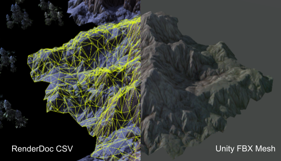
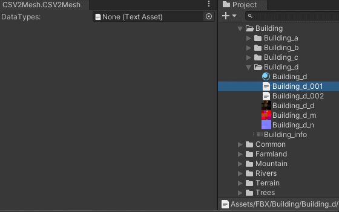
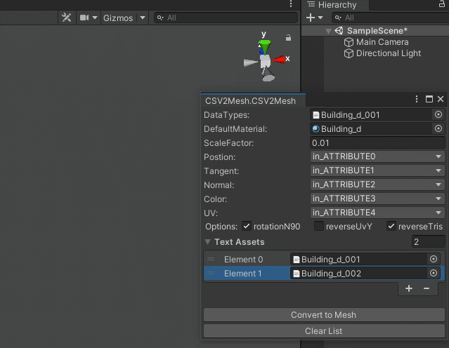
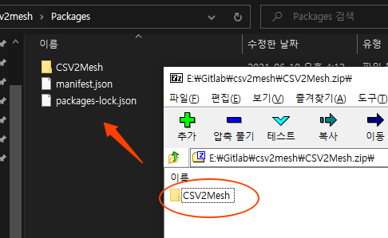

# CSV to Mesh

## 介绍:
* 这是一个将Renderdoc截帧出来的模型csv文件批量转换为UnityMesh的工具，且支持生成FBX格式文件。

## 链接:
* [CSV to Mesh Manual](https://docs.google.com/document/d/1AhV_cnfvHrPxS8tml4bKN3fvbJhaSxunfy4rj3j1GVA/edit?usp=sharing)

## 安装:
* [下载安装包](CSV2Mesh.zip)
* 安装包解压到“...\工程目录\Packages\” 文件夹里，如下图。

## 限制：
* 无

## 完成度：
* 100%

## 未完成功能：
* 无
