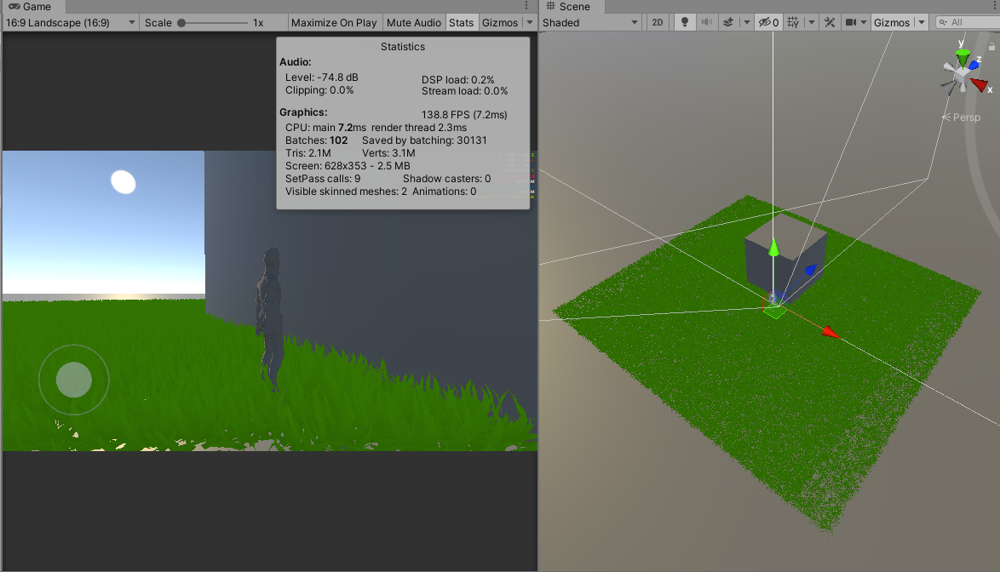
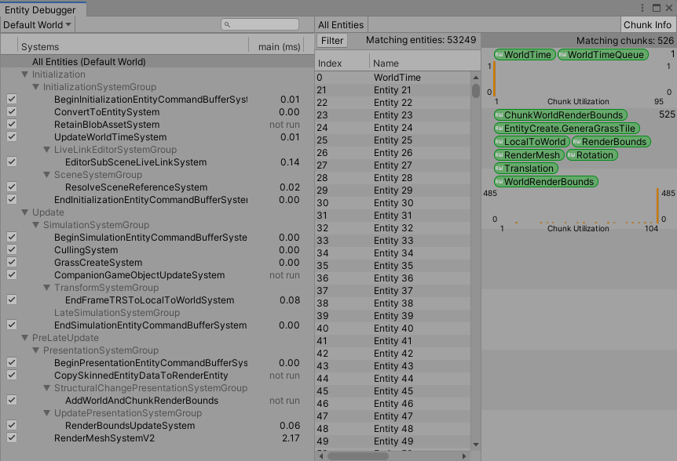

# GrassSystem - ECS Based Culling System

这段时间事情比较多，一直没机会整理总结一下最近学习和实践的内容。近期接到了一个草海的需求，嗯，一个希望能够在移动中端机上跑起来的草海。


市面上各草海的实现方式基本上都离不开DrawInstance，单棵草的实现有alpha test的面片草与模型草两种，PC上简单测了测性能开销差不多，但在手机上，模型草的性能表现是远远优于alpha text的面片草，所以决定还是使用模型草来实现草海的效果。


模型草


面片草


模型草带来的最大的问题就是顶点数非常非常非常多，所以默认的相机视锥剔除是肯定不够的，草的各级lod也是需要花精力去调整。一个完整的草海系统应该包括了资源生产工具链（美术定制草海效果的工作流），加载剔除方案与各级lod混合方案，以及最终美术表现效果，与玩家、场景的交互三个部分。本文的内容主要聚焦于草海的加载剔除，距离完整的可落地的工程还是有蛮大的距离，望各位看官海涵~

## Hybrid Rendering Vs DrawInstance

一般常见的草海实现都是将地形分为一个一个的Tile，每个tile经过四叉树或者其他的空间管理结构做颗粒度较大的剔除，筛选出剩余的相机可见Tile，自己准备好数据通过DrawInstance接口合批绘制，或者通过Computer Shader进行颗粒度更细的视锥剔除、Occlusion Culling等，调用DrawInstanceIndirect接口绘制。但由于移动端对CS的支持不太稳定，出于保守考量还是决定放弃CS相关的解决方案。

Unity ECS提供了一套名为Hybrid的渲染组件，通过指定mesh，material以及renderbounds的AABB，Hybrid系统基于组件进行DrawInstance的快速提交，这边在PC上面进行了粗略的测试，速度比DrawInstance要快一丢丢。但各机型对Hybrid的支持情况目前没有足够的数据统计，好在Hybrid和传统的DrawInstance属于可互相替代的两种渲染方式，前者是Unity提供的批量渲染框架，后者更多依赖于自己手动控制，最终选择哪种方案可以由项目组决定。

简单说下两种方案的区别（只是自己粗略看法，不完全也不一定正确）：DrawInstance由于是自己主动调用的API接口，通过好的资源管理规划，是可以充分利用好每次1024个最大实例数的。但Hybrid有自己的资源管理方式，每次提交数量一般也达不到Instance的最大数量（这个不知道是不是我用的姿势不对），导致Draw Call会比手动调用DrawInstance要高出不少，但得益于Hybrid的渲染数据管理框架，Hybrid的数据整理，合并，提交速度比我们自己手动管理的要快上不少（如果自己完全造一个相同的轮子应该可以达到差不多的运行效率），并且Hybrid可以通过RenderBounds做到对单个实例的视锥剔除，而非基于tile的粗略的剔除，这样由cpu提交的数据量会比直接DrawInstance要少一些。

Demo还是使用的Hybrid，既然决定用ECS了，就用彻底嘛~

## Simple Grass System

Hybrid的使用这边就不过多介绍了，不了解的小伙伴可以参考[这篇文章](https://www.lfzxb.top/unity-dots-using-ecs-create-gameplay/)。由于草海是在游戏运行时才会被实例化的，所以我们只需要准备好一个实例（包含Mesh和Material），预生成或者加载进游戏时生成所有实例需要的position，rotation数据即可。

```
public static List<float3>[] posList;
public static List<quaternion>[] rotList;


void CreateECSEntity(float3 centerPos,int index)
{
    var poslist = CullingManager.posList[index];
    var rotlist = CullingManager.rotList[index];
    for (int i = 0; i < InstanceCount; i++)
    {
        var randomRot = Quaternion.AngleAxis(UnityEngine.Random.Range(0f, 180), Vector3.up);
        var randomPos = new float3(UnityEngine.Random.Range(-1f, 1f), 0f, UnityEngine.Random.Range(-0.5f, 0.5f)) * TileSize + centerPos;
        poslist.Add(randomPos);
        rotlist.Add(randomRot);
    }
    CullingManager.spheres[index] = new BoundingSphere(centerPos, TileSize * 1.5f);
}

```

生成好基础数据，直接装填entity即可：
```
public void CreateEntitiesByList(List<float3> posList, List<quaternion> rotList,int index)
{
    EntityArchetype entityArchetype = entityManager.CreateArchetype(
       typeof(LocalToWorld),
       typeof(RenderMesh),
       typeof(RenderBounds),
       typeof(Translation),
       typeof(Rotation),
       typeof(GeneraGrassTile)
       );
    RenderMesh RM = cullMgr.GetRenderMesh();
    NativeArray<Entity> entityGroupArray = new NativeArray<Entity>(InstanceCount, Allocator.Temp);
    entityManager.CreateEntity(entityArchetype, entityGroupArray);
    AABB tmpAB = cullMgr.grassAABB;
    for (int i = 0; i < InstanceCount; i++)
    {
        var randomRot = rotList[i];
        var randomPos = posList[i];

        Entity entityGroup = entityGroupArray[i];
        entityManager.SetComponentData(entityGroup, new Translation { Value = randomPos });
        entityManager.SetComponentData(entityGroup, new Rotation { Value = randomRot });
        entityManager.SetSharedComponentData(entityGroup, RM);
        entityManager.SetComponentData(entityGroup, new RenderBounds { Value = tmpAB });
        entityManager.SetComponentData(entityGroup, new GeneraGrassTile() { tile_id = index });
    }
    entityGroupArray.Dispose();      
}

```

嗯，Mathematics库的使用是必须的，除了ECS本身需要，Mathematics库也提供了直接到硬件的映射，反正用起来飞快就是了！

然后看一下PC跑起来的帧率~





十万个实例跑起来还是够呛呐，我们当然不能满足于此，Culling 搞起来！

## Culling Group With ECS

由于本人手上的轮子不多，要自己再去手撸一套四叉树实在是嫌麻烦，Unity提供了Culling Group，对于我这种测试demo或者关卡式面积不大的场景已经够用了。Culling Group的使用说明大家可以自己翻翻官方文档API或者看看别人写的文章，我这边也不介绍细节了，直接上手开撸。需要注意的是，Culling Group本身的可见性判断是会带来一定的性能开销的，有文章提到说几千个Culling Group需要占用的cpu时间就有1-2ms，所以Culling Group的大小和数量在具体项目应用的时候是需要仔细考量的，滥用甚至可能会带来负优化！

因为我这个只是测试demo，所以结构很简单，每个Tile中有1024个草的实例，一个Tile对应一个Culling Group，场景内有 10 * 10 个Tile。因为现在暂时不考虑LOD相关的内容，所以Culling Group我们只需要设置BoundingSpheres，Distance可以先不管。

```
public static BoundingSphere[] spheres;

void CreateECSEntity(float3 centerPos,int index)
{
    ···
    for(···){
    	···
    }
    CullingManager.spheres[index] = new BoundingSphere(centerPos, TileSize * 1.5f);
}

···
cullingGroup.SetBoundingSpheres(spheres);
cullingGroup.SetBoundingSphereCount(spheres.Length);
cullingGroup.onStateChanged += OnStateChange;

void OnStateChange(CullingGroupEvent evt)
{
    var cullsystem = World.DefaultGameObjectInjectionWorld.GetExistingSystem<CullingSystem>();
    if (cullsystem != null)
    {
        if (evt.hasBecomeInvisible)
        {
            CullIndexList.Add(evt.index);
            
        }
        else if (evt.hasBecomeVisible)
        {
            int index = evt.index;
            EntityMgr.CreateEntitiesByList(posList[index], rotList[index], index);
        }
    }
       
}

```

entity实例的销毁是通过自定义的Culling System去做的：

```
public class CullingSystem : ComponentSystem
{
    protected override void OnUpdate()
    {
        if(CullingManager.CullIndexList.Count > 0)
        {
            Entities.WithAll<EntityCreate.GeneraGrassTile>().ForEach((Entity en, ref EntityCreate.GeneraGrassTile GrassTile) => {

                if (CullingManager.CullIndexList.Contains(GrassTile.tile_id))
                {
                    PostUpdateCommands.DestroyEntity(en);
                }
            });
            CullingManager.CullIndexList.Clear();
        }
        return;
    }
}

```

我们来看一下效果：





ECS的各System Update时间不同，可以根据需要指定到player loop的指定位置，具体可以参考[这篇文章](http://dingxiaowei.cn/2020/02/09/)。乍一看感觉性能是有提升的，但这种做法会带来一个非常严重的问题：


在相机移动时候，由于需要动态的删除/创建Entity，导致CPU时间非常高，单纯的使用Culling显然是不能达到要求的。所以，我们需要想办法优化，让Entity的增删快起来。


## Optimize Culling/Creating System

造成上述卡顿最主要的原因是，不论我们直接调用CreateEntitiesByList接口创建entity，还是说通过CullingSystem去销毁实体，这两个操作都是在主线程中完成的。ComponentSystem只是利用entity内存上连续的特点，遍历操作会比较快，但其update方法的回调还是需要等待内部方法调用完成后才提交，导致我们在相机移动时，entity的创建销毁占用了主线程大量时间。知道了问题原因所在，优化的方向就很明确了：将entity创建/删除操作从主线程中剥离出来。

### JobComponentSystem

Unity提供了Unity.Jobs库来完成多线程相关的操作，而ECS System中的JobComponentSystem就像是一个封装好的多线程框架，我们可以很方便的通过JobComponentSystem去实现我们的多线程逻辑，更多细节大家可以去翻相关的文档。这里需要注意的是，entity的创建，删除等操作是无法在job中完成的，需要通过将操作压栈入一个EntityCommandBuffer，在之后对应的Entity CommandBuffer System更新中，取出buffer中的数据，完成创建、删除等操作。

首先，Culling Group相关的内容稍微修改一下：
```
if (evt.hasBecomeInvisible)
{
    CullIndexList.Add(evt.index);  
}
else if (evt.hasBecomeVisible)
{
    CreateIndexList.Add(evt.index);
}
```

简单的Culling System

```
public class CullingSystem : JobComponentSystem
{  
    EntityCommandBufferSystem EntityCommandBufferSystem;

    protected override void OnCreate()
    {
        EntityCommandBufferSystem = World.GetExistingSystem<EndSimulationEntityCommandBufferSystem>();
    }

    protected override JobHandle OnUpdate(JobHandle inputDeps)
    {
        if(CullingManager.CullIndexList.Count > 0)
        {
            int totalCount = CullingManager.CullIndexList.Count;
            var EntityCommandBuffer = EntityCommandBufferSystem.CreateCommandBuffer().ToConcurrent();
            NativeArray<int> totalTileID = new NativeArray<int>(totalCount, Allocator.Persistent);
            for(int i = 0; i < totalCount; i++)
            {
                totalTileID[i] = CullingManager.CullIndexList[i];
            }
            var jobhandle = Entities.ForEach((Entity en, int nativeThreadIndex, ref EntityCreate.GeneraGrassTile GrassTile) => {

                for(int i = 0; i < totalCount; i++)
                {
                    if(totalTileID[i] == GrassTile.tile_id)
                    {
                        EntityCommandBuffer.DestroyEntity(nativeThreadIndex, en);
                        return;
                    }
                }
            }).Schedule(inputDeps);
            CullingManager.CullIndexList.Clear();
            EntityCommandBufferSystem.AddJobHandleForProducer(jobhandle);
            jobhandle.Complete();
            totalTileID.Dispose();
            return jobhandle;
        }

        return inputDeps;
    } 
}

```

Job中无法使用引用类型的数据，只能处理值类型的数据，所以需要通过NativeArray传递数据，其他的就是基本的JobSystem用法。

Creating System会稍微复杂一些：首先，每帧我们可能会有多个Tile状态变为可见，与其一组一组的整理好数据派生job，不如把这些Tile相关的traslation，rotation等数据打包在一起，直接分发一个job即可完成。更进一步，由于我们使用的是List管理数据（这个处于潜在的动态考量，放弃直接使用Array），List转变为Array是非常高效的：

```
public T[] ToArray()
{
    T[] destinationArray = new T[this._size];
    Array.Copy(this._items, 0, destinationArray, 0, this._size);
    return destinationArray;
}
```

转成Array后，可以通过NativeArray.Copy()方法，快速将Array数据拷贝至NativeArray中。这个接口的底层实现应该类似C++的memcopy，速度比传统的for循环值拷贝快了非常多,demo测试中数千个值的拷贝比遍历方法能够快2ms左右。单纯遍历的开销不应该这么大，猜测应该是涉及到Array到NativeArray类型转换带来的额外开销，而Copy方法能够规避这种转换带来的额外开销。（cpp在效率方面对C#真就降维打击？）

其次，entityArray的创建可以通过实例化一个entity实例，再通过这个entity去实例化整个entityArray，之后只需要修改entityArray中特殊的component即可。这个是因为entityArray的实例化过程也类似于一个值拷贝的过程，有一些不变的值比如RenderMesh，没有缩放情况的Renderbounds等，只需要在第一个entity中设置一次，之后用该entity实例化entityArray即可。

最后，还有一个对效率提升非常大的Tag：FrozenRenderSceneTag，这个是作为一个SharedComponentData存在于entity中的，具体含义在文档中没看明白，但翻了翻Hybrid的源码，看意思应该是，Hybrid在做动态batch的时候，会将所有实体对象分为m_FrozenGroup和m_DynamicGroup，m_FrozenGroup在场景FrozenRenderSceneTag没有变化的情况下，只会初始化设置一次，而m_DynamicGroup每帧都会设置一堆东西。在有十万个entity时，挂载FrozenRenderSceneTag，Hybrid的RnderMeshSystem开销只有不到1ms，如果不挂载，所有entity走m_DynamicGroup那一套，这个时间开销就会达到8-10ms，差距非常大。不过本人对于query、chunk的理解还不到位，对这一块内容也是似懂非懂，欢迎各位大佬指正。


上Creating System的代码吧：

```
public class GrassCreateSystem : JobComponentSystem
{
    private struct ArrayData
    {
        public NativeArray<float3> posList;
        public NativeArray<Quaternion> rotList;
        public int tile_id;
        public int writeOffset;
        
        public NativeArray<float3> FinalPosList;
        public NativeArray<Quaternion> FinalRotList;
        public NativeArray<int> FinalTileList;
    }

    private struct grassArrayDataJob : IJobParallelFor
    {
        public ArrayData aryData;
        public void Execute(int index)
        {
            aryData.FinalPosList[aryData.writeOffset + index] = aryData.posList[index];
            aryData.FinalRotList[aryData.writeOffset + index] = aryData.rotList[index];
            aryData.FinalTileList[aryData.writeOffset + index] = aryData.tile_id;
        }
    }

    private struct Data
    {
        public NativeArray<Entity> entityArray;
        public NativeArray<float3> posList;
        public NativeArray<quaternion> rotList;
        public float3 extend;
        public float3 center;
        public NativeArray<int> tileIDList;
    }
    private struct grassCreateJob : IJobParallelFor
    {
        [ReadOnly]
        public Data data;
        public void Execute(int index)
        {

            var entityManager = World.DefaultGameObjectInjectionWorld.EntityManager;
            var randomRot = data.rotList[index];
            var randomPos = data.posList[index];

            Entity entityGroup = data.entityArray[index];
            entityManager.SetComponentData(entityGroup, new Translation { Value = randomPos });
            entityManager.SetComponentData(entityGroup, new Rotation { Value = randomRot });
            entityManager.SetComponentData(entityGroup, new RenderBounds { Value = new AABB() { Extents = data.extend, Center = data.center } });
            entityManager.SetComponentData(entityGroup, new EntityCreate.GeneraGrassTile() { tile_id = data.tileIDList[index] });

        }
    }
    protected override JobHandle OnUpdate(JobHandle inputDeps)
    {
        int loopCount = CullingManager.CreateIndexList.Count;
        if(loopCount > 0)
        {
            
            var cullMgr = CullingManager.Get();
            var entityMgr = cullMgr.EntityMgr;
            var entityManager = World.DefaultGameObjectInjectionWorld.EntityManager;
            EntityArchetype entityArchetype = entityManager.CreateArchetype(
               typeof(LocalToWorld),
               typeof(RenderMesh),
               typeof(RenderBounds),
               typeof(Translation),
               typeof(Rotation),
               typeof(EntityCreate.GeneraGrassTile),
               typeof(FrozenRenderSceneTag)
               );
            int InstanceCount = entityMgr.InstanceCount;
            int totalCount = loopCount * InstanceCount;
            RenderMesh RM = cullMgr.GetRenderMesh();
            AABB tmpAB = cullMgr.grassAABB;

            var grassEntity = entityManager.CreateEntity(entityArchetype);
            entityManager.SetSharedComponentData(grassEntity, RM);
            entityManager.SetSharedComponentData(grassEntity, new FrozenRenderSceneTag { HasStreamedLOD = 1, SectionIndex = 1 });
            NativeArray<Entity> entityGroupArray = new NativeArray<Entity>(totalCount, Allocator.Persistent);
            entityManager.Instantiate(grassEntity, entityGroupArray);
            entityManager.DestroyEntity(grassEntity);
            
            NativeArray<float3> totalPos = new NativeArray<float3>(totalCount, Allocator.Persistent);
            NativeArray<quaternion> totalRot = new NativeArray<quaternion>(totalCount, Allocator.Persistent);
            NativeArray<int> totalTileID = new NativeArray<int>(totalCount, Allocator.Persistent);
            
            for (int i = 0; i < loopCount; i++)
            {
                int startOff = i * InstanceCount;
                NativeArray<float3>.Copy(CullingManager.posList[CullingManager.CreateIndexList[i]].ToArray(),0, totalPos, startOff, InstanceCount);
                NativeArray<quaternion>.Copy(CullingManager.rotList[CullingManager.CreateIndexList[i]].ToArray(), 0, totalRot, startOff, InstanceCount);
                int[] tileIDtmp = Enumerable.Repeat(CullingManager.CreateIndexList[i], InstanceCount).ToArray();
                NativeArray<int>.Copy(tileIDtmp, 0, totalTileID, startOff, InstanceCount); 
            }

            grassCreateJob job = new grassCreateJob()
            {
                data = new Data()
                {
                    entityArray = entityGroupArray,
                    posList = totalPos,
                    rotList = totalRot,
                    extend = tmpAB.Extents,
                    center = tmpAB.Center,
                    tileIDList = totalTileID
                }
            };
            var t_handle = job.Schedule(totalCount, 1);
            CullingManager.CreateIndexList.Clear();
            t_handle.Complete();

            entityGroupArray.Dispose();
            totalPos.Dispose();
            totalRot.Dispose();
            totalTileID.Dispose();
        
        }
        return inputDeps;
    }
}

```

放一段视频吧~

<video src="./Img/ECSCulling.mp4" controls="controls" width="500" height="300">您的浏览器不支持播放该视频！</video>


## 最后的碎碎念

一晃就半年没写过东西啦，以后还是要让自己经常性的总结分享一下。工程目前还没有整理完成，只拿出了关键代码放到git上了，之后做完LOD相关的研究工作，有机会再整理成一个pakage扔git上吧。

嗯，老样子，欢迎大家关注我的公众号：void_TATa Tiny TA的碎碎念

github：https://github.com/Alunice/TaTa/tree/master/GrassSystem/ECSCulling


## References  

1. http://dingxiaowei.cn/2020/02/09/

2. https://zhuanlan.zhihu.com/p/32190878

3. https://zhuanlan.zhihu.com/p/66407205

4. https://www.lfzxb.top/unity-dots-part-of-components/

5. https://docs.unity3d.com/Packages/com.unity.entities@0.7/api/Unity.Entities.html

6. https://www.lfzxb.top/unity-dots-using-ecs-create-gameplay/