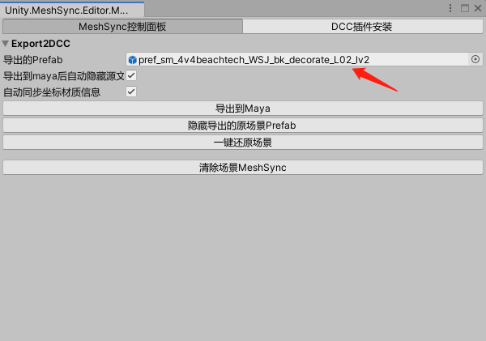

# MeshSync使用说明

本插件是基于Unity MeshSync原生插件扩展的DCC Unity同步工具，可实现DCC中模型修改在unity端的实时查看，并且支持Unity场景一键导回DCC，修改完成后一键导出到原FBX文件等功能。
## 安装步骤

### unity插件安装

将压缩包文件解压后，com.unity.meshsync@0.4.0-preview 文件夹拷贝至工程Package目录下。

### Maya插件安装

#### 自动安装

在Unity中打开 ArtTools/Scene Tools 场景工具/MeshSync 控制面板。

点击DCC插件安装，选择正确的Maya安装目录。（可右键单击桌面Maya图标，选择属性，查看安装目录）

点击一键安装Maya插件按钮。

#### 手动安装

打开 我的电脑-文档-maya 目录，将 com.unity.meshsync@0.4.0-preview/DCCTools~/maya/modules 文件夹拷贝到该目录。

打开maya，选择 Windows->Settings/Preferecences->Plug-in Manager打开插件管理窗口。在窗口中搜索MeshSyncClientMaya.mll，勾选loaded和Auto load。

此时，在shelf UI中可以看到MeshSync插件：

若shelf中未找到UnityMeshSync栏，则需要手动将 com.unity.meshsync@0.4.0-preview/DCCTools~/maya/shelf_UnityMeshSync.mel 拷贝至 我的电脑-文档-maya-[对应maya版本]-prefs-shelves 目录下，以2019版本为例，将该mel文件拷贝至如图：

## 使用说明

### 启动MeshServer

首先，在unity中打开MeshSync控制面版，选择 控制面板 界面，点击创建MeshSync按钮

打开Maya，点击UnityMeshSync的设置，打开Unity Mesh Sync面板

完成以上操作，MeshServer会自动启动进行数据同步。

### Unity 导出场景到DCC

选择场景中的prefab，拖拽到面板上，点击 导出到Maya 按钮，即可导出到Maya。注意，请确保prefab引用的mesh来自于fbx文件（Unity 创建的3D Object，Mesh信息存放在内存中，无法直接导出到Maya，请先将Mesh导出为FBX，再点击 导出到Maya 按钮）。

### DCC保存修改好的模型到FBX文件

修改好模型后，在Maya中打开的Unity Mesh Sync面板下找到Export FBX 按钮，即可自动将模型导出到原FBX文件中。

## 更多说明

更多说明详见官方文档（ https://github.com/unity3d-jp/MeshSync ）