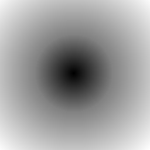

# signed distance field 
最近UE4.26上线了，离UE5又近了一点。UE的各种渲染大量运用了一种名为Signed Distance Field的技术，前段时间刷屏的《黑神话·悟空》的主程，在一次分享会上也介绍说《悟空》项目中，使用了SDF来实现了诸多效果。为了制作SDF的demo，这段时间查阅了许多资料，发现关于SDF字体的文章比较多，运用相关的也不少，但很少有文章去解释SDF到底是什么样的一种技术，为什么它能解决那么多用其他传统方案不太好处理的问题。所以，本篇文章是以一个自学者的视角去理解SDF，如有错误，还请指正~

signed distance field，中文名为有向距离场，SDF有2D和3D的区别，它的定义非常简单：每个像素（体素）记录自己与距离自己最近物体之间的距离，如果在物体内，则距离为负，正好在物体边界上则为0。

以简单的图为例，如下：


我们规定白色表示为物体，黑色表示为空，那么这样一副中间一个圆的图像，其对应的SDF图应该就是这样：



为了图片显示，将有向距离值映射到了[0-1]范围，0.5表示物体内外的分界线。可以清楚看到，位于圆中心的点是最黑的，因为它处于物体最内部，而图片的四个角最白，因为它们距离圆最远。有了大概印象，那我们就正式开始SDF的学习。

## SDF生成算法 - 8ssedt 

SDF的定义很简单，生成一张SDF图的算法也不难，暴力出奇迹嘛~但暴力算法的复杂度达到了平方级，当图片分辨率达到1K，估摸着算一次需要的时间都够下楼买杯奶茶了。虽然SDF大部分是离线生成的，但保不准也会有实时性的需求，而且作为程序员（虽然和之前比已经很少写代码了），还是要追求一下代码的优雅。

8ssedt就是一种能在线性时间内，计算出SDF的算法。在介绍8ssedt之前，我们先来分析一下SDF的特点。首先，我们设定像素点值为0表示空，1表示为物体，那么对于任何一个像素点，我们要找距离它最近的目标像素点，就有以下几种情况：

* 像素点值为1：自身就是目标点，所以距离为0。

* 像素点值为0：目标点应该在自己的四周，但可能是上下左右任意一方向。

第一种情况很简单，麻烦就麻烦在第二种情况，那我们再细分第二种情况。假如当前像素点周围最近的某个像素（上下左右四个方向距离为1的像素）正好为1，那我这个像素点的SDF就应该为1，因为不会有更近的情况了，其次就是左上左下右上右下四个点，如果有为1的点，那该像素点的SDF值就应该为根号2。以此类推，如果我知道了当前像素点周围所有像素的SDF值，那么该像素点的SDF值一定为：

**MinimumSDF(near.sdf + distance(now,near))**

near表示附近像素点，now表示当前像素，near.sdf表示near的SDF值，distance表示两点之间距离。

有木有很熟悉的感觉，这就是妥妥的动态规划的递推公式啊！用伪代码完整的表示：

```
now.sdf = 999999;
if(now in object){
	now.sdf = 0;
}else{
	foreach(near in nearPixel(now)){
		now.sdf = min(now.sdf,near.sdf + distance(now,near));
	}
}
```

弄清楚了最核心的递推公式，那就可以直接上8ssedt的代码了：

```
#define WIDTH  256
#define HEIGHT 256

struct Point
{
    int dx, dy;

    int DistSq() const { return dx*dx + dy*dy; }
};

struct Grid
{
    Point grid[HEIGHT][WIDTH];
};

Point inside = { 0, 0 };
Point empty = { 9999, 9999 };
Grid grid1, grid2;

Point Get( Grid &g, int x, int y )
{
    // OPTIMIZATION: you can skip the edge check code if you make your grid 
    // have a 1-pixel gutter.
    if ( x >= 0 && y >= 0 && x < WIDTH && y < HEIGHT )
        return g.grid[y][x];
    else
        return empty;
}

void Put( Grid &g, int x, int y, const Point &p )
{
    g.grid[y][x] = p;
}

void Compare( Grid &g, Point &p, int x, int y, int offsetx, int offsety )
{
    Point other = Get( g, x+offsetx, y+offsety );
    other.dx += offsetx;
    other.dy += offsety;

    if (other.DistSq() < p.DistSq())
        p = other;
}

void GenerateSDF( Grid &g )
{
    // Pass 0
    for (int y=0;y<HEIGHT;y++)
    {
        for (int x=0;x<WIDTH;x++)
        {
            Point p = Get( g, x, y );
            Compare( g, p, x, y, -1,  0 );
            Compare( g, p, x, y,  0, -1 );
            Compare( g, p, x, y, -1, -1 );
            Compare( g, p, x, y,  1, -1 );
            Put( g, x, y, p );
        }

        for (int x=WIDTH-1;x>=0;x--)
        {
            Point p = Get( g, x, y );
            Compare( g, p, x, y, 1, 0 );
            Put( g, x, y, p );
        }
    }

    // Pass 1
    for (int y=HEIGHT-1;y>=0;y--)
    {
        for (int x=WIDTH-1;x>=0;x--)
        {
            Point p = Get( g, x, y );
            Compare( g, p, x, y,  1,  0 );
            Compare( g, p, x, y,  0,  1 );
            Compare( g, p, x, y, -1,  1 );
            Compare( g, p, x, y,  1,  1 );
            Put( g, x, y, p );
        }

        for (int x=0;x<WIDTH;x++)
        {
            Point p = Get( g, x, y );
            Compare( g, p, x, y, -1, 0 );
            Put( g, x, y, p );
        }
    }
}

int main( int argc, char* args[] )
{
	for( int y=0;y<HEIGHT;y++ )
	{
		for ( int x=0;x<WIDTH;x++ )
		{
			Uint8 r,g,b;
			Uint32 *src = ( (Uint32 *)( (Uint8 *)temp->pixels + y*temp->pitch ) ) + x;
			SDL_GetRGB( *src, temp->format, &r, &g, &b );			
			// Points inside get marked with a dx/dy of zero.
			// Points outside get marked with an infinitely large distance.
			if ( g < 128 )
			{
				Put( grid1, x, y, inside );
				Put( grid2, x, y, empty );
			} else {
				Put( grid2, x, y, inside );
				Put( grid1, x, y, empty );
			}
		}
	}
    ......
    // Generate the SDF.
    GenerateSDF( grid1 );
    GenerateSDF( grid2 );
    ......
}
```
8ssedt首先遍历一遍图像，将物体内和物体外的点标记出来，这里有两个gird，因为是有向距离场，分别计算物体外到物体的距离，以及物体内部的点到物体外的距离，如前文提到一般，前者为正值，后者为计算出SDF后视距离为负值。

核心函数就是GenerateSDF，一步步来看：

```
for (int x=0;x<WIDTH;x++)
{
    Point p = Get( g, x, y );
    Compare( g, p, x, y, -1,  0 );
    Compare( g, p, x, y,  0, -1 );
    Compare( g, p, x, y, -1, -1 );
    Compare( g, p, x, y,  1, -1 );
    Put( g, x, y, p );
}


void Compare( Grid &g, Point &p, int x, int y, int offsetx, int offsety )
{
    Point other = Get( g, x+offsetx, y+offsety );
    other.dx += offsetx;
    other.dy += offsety;

    if (other.DistSq() < p.DistSq())
        p = other;
}
```
这实质上就是找目标点及左上方四个点中，SDF最小的值。PASS0就是按照从上到下，从左到右的顺序，遍历整个图像，遍历完成之后，对于所有物体外的点，如果距离它最近的物体是在它的左上方，那么它的SDF值就已确定。类似的，PASS1就是按照从下到上，从右到左的顺序，依次比较右下方的四个点，遍历完成之后，对于所有物体外的点，如果距离它最近的物体是在它的右下方，那么它的SDF也已经确定了。两个PASS结合，那么整个图像的SDF就都计算出来了。（其实这里称SDF并不准确，因为只算了物体外到物体边界的距离，是正值，并没有signed一说，只有做完下一步计算物体内到物体外的距离，两个距离相减，才是SDF）

第二个grid的GenerateSDF就很好理解了，就是计算物体内部到外部的距离。因为一个点要么在物体内要么在物体外，所以两次的SDF值要么全为零（在边界上），要么一个为0，一个为距离值。用：grid1(pixel).sdf - grid2(pixel).sdf就能得到完整的SDF。

https://www.jianshu.com/p/58271568781d 这篇文章作者从编译的角度对cpp代码进行了优化，居然可以减少一半的运行时间，感兴趣的朋友可以深入研究一下SIMD相关的内容。unity最近也更新了许多库和API来支持SIMD，其实从数据结构的角度，面向对象的编程是不如面向数据的编程的，unity的DOTS，以及ECS应该会慢慢普及开来，之后应该会写一篇unity最新API使用相关的文章，最近事情有点多~

## SDF vs Bitmap

SDF最常见的应用是各种字体，知乎上https://zhuanlan.zhihu.com/p/26217154 这篇文章详细介绍了SDF在文字方面的应用。我们来探索一下更普遍的应用场景。

比如说这是一张雪花的贴图：


我们生成它对应的SDF贴图：


根据SDF贴图生成的规则，0.5表示边界，小于0.5表示在物体内，那么我们导入unity后，在shader中将大于0.5的部分去掉，小于0.5的部分颜色设为1，可以得到下面这样一张和原始贴图的对比图：


乍一看其实是看不出来这两张图片有什么区别的，但是如果我们把图片放大几倍再看看：


可以很明显的看出两者的区别了，前者SDF生成的图像边缘依旧保持光滑锐利，而雪花贴图放大后因为精度不足已经出现了非常多的锯齿，这其实就像是PS中，矢量图和位图的区别。

### alias and anti-aliasing

在游戏领域、或者说计算机图形学领域，AA抗锯齿永远是一个不断寻求更优解的过程。关于什么是锯齿，锯齿产生的本质原因大家可以看闫大大的计算机图形学课程https://www.bilibili.com/video/BV1X7411F744?p=6 ，强烈推荐！看完这些课程，就能够把图像，锯齿，走样，数字信号相关的知识点联系起来。

那么，为了要弄清楚SDF保持高清放大的原因，我们先要理清楚SDF和位图区别。

首先，我们初衷是为了传递一组信息（信号），比如说一片雪花的几何形状。为了传递这组信号，我们使用了两种不同的技术手段：SDF和位图。SDF使用一定分辨率的图片，存储了每个像素点与雪花边界的距离，接受到这些信号后（收到贴图），我们需要通过接收到的内容重建原始信号，所以我们要使用SDF对应的方法处理图片（小于0.5部分表示在雪花内），才能得到雪花的形状。而位图就简单粗暴，我每个像素点存放的，就是直观的RGB颜色，直接显示在屏幕上就好了。

假设两种贴图都是256的精度，那么看上去好像没什么问题（图1），但如果我们现在需要显示1K大小的图像，那么我们就需要对两种贴图进行放大操作。

在介绍渲染管线的时候，我们有说过，GPU是通过插值的方式来确定中间点的信息。将贴图从256放大到1024，平均下来，256贴图中每相邻的两个像素之间要插入三个像素点：

```
A B1 B2 B3 C
B1 = A * 0.75 + C * 0.25
B2 = A * 0.5 + C * 0.5
B3 = A * 0.25 + C * 0.75
```
对于位图信息，每个像素点中存放的是RGB颜色，是标量，通过插值运算得到的结果无实际意义。但对于SDF，每个点存放的是到边界的有向距离，是一个向量，向量通过插值运算得到的结果就是某种意义上，这个新增点应该有的值：
```
Bitmap 存储各点的颜色
A B1 B2 B3 C
A = (0,0,0),C = (1,1,1)
B1 = A * 0.75 + C * 0.25 = (0.25,0.25,0.25)
B2 = A * 0.5 + C * 0.5 = (0.5,0.5,0.5)
B3 = A * 0.25 + C *0.75 = (0.75,0.75,0.75)  //无实际意义的颜色

SDF,存储距离原点的距离
A B1 B2 B3 C
A = (0,0),C = (4,0)
B1 = A * 0.75 + C * 0.25 = (1,0)
B2 = A * 0.5 + C * 0.5 = (2,0)
B3 = A * 0.25 + C *0.75 = (3,0)  //B1 B2 B3 "正确"的与原点之间的距离
```
位图存的是每个像素点颜色，颜色是一个标量。两个颜色相加再平均是没有意义的，只是数学上面的混合,对于图像还原来说，就是错误的。SDF每个像素点存的是一个有方向的矢量，最终变成我们看见的图片是需要通过一个计算才能还原的,所以直接对SDF图的像素点操作，实质上是操作向量,放大过程实质上就是向量重建的过程，是不损失精度的。SDF就是利用了插值器的特性实现了光滑放大效果。

## smooth lerp between textures
除了字体方面的应用，SDF还能够实现图像之间的平滑过渡，对不同图像的两张SDF进行插值就行了。


在shader中只需要简单的插值：
```
half4 col = half4(1,1,1,1);
half a1 = lerp(color1.r , color2.r, _SDFLerp);
col.a = smoothstep(0.5, 0.5 - _SmoothDelta , a1);
```
就能得到比较理想的过渡效果：


对于每个像素点，本质上是距离上的平滑过渡，转换成RBG颜色就是图像间的平滑过渡了。

在非真实感渲染的领域中，如卡通渲染，很多像阴影，高光之类的表现都是有艺术家们控制生成的，大部分都是物理不正确的，甚至许多游戏为了使3D角色看起来更像2D手绘卡通人物，做了许许多多特殊处理。

SDF技术在卡渲相关资源的创作过程中，也起到了非常大的作用。

<iframe height=540 width=960 src="https://github.com/Alunice/TaTa/tree/master/SDF/img/change.mp4" frameborder=0 allowfullscreen></iframe>

这是卡通渲染时脸部阴影的制作方式，简单来说就是艺术家绘制好一些特定光线角度时的脸部阴影，然后通过SDF插值计算出中间过程，并将中间过程叠加到一张图上，通过简单的blur或者smooth操作实现平滑。

这是我用上面两张SDF生成的平滑图像：


在ps中使用阙值可以查看过渡效果：


在视频中，角色脸部阴影使用了多张贴图，最后融合到一张贴图上，实现的平滑过渡，但使用SDF的话，一张原始贴图就要对应一张SDF图，五张原始贴图的平滑渐变就需要五张SDF图来做插值。为什么使用这种方式能节省多张贴图资源？

### no free lunch
首先，生成的smooth贴图由SDF退化成了位图，每个像素点存储的就是RGB颜色，只是通过阙值来控制显示不同的像素。其次，该方法对原始贴图也有了限制，因为各插值图像是简单叠加在一起的，而使用方式是通过控制阙值显示不同的图像，所以这就要求原始图像的对应像素点之间一定是一个单调变化的关系。

比如说，我用三张贴图ABC简单叠加在一起。假设像素x在贴图A的值为0，B为1，C为1，叠加结果像素x的值为：

x=(0+1+1) / 3 =0.66667

我们令小于阙值的像素点显示，只需要将阙值由1减到0，就能实现x像素由A-B-C的正确显示。反之，在ABC的值分别为(1,1,0)，只需要将阙值由0-1变化即可。

但是，如果ABC中同时存在以上两种情况的像素点，无论怎么控制阙值，都无法实现图像的正确显示。或者，对于像素点y在ABC的值分别为(0,1,0)，得到y的值为0.333，同样无法通过阙值来描述点y(0-1-0)的变化过程。

所以，使用该方法生成的smooth图一方面限制了精度（贴图4通道32位单通道精度256），另一方面限制了使用情景。但在少数场合中使用该方案的性价比还是非常高的。

## 碎碎念
这篇只是SDF一些基础介绍和相关内容的学习心得，3D的SDF暂时还没有看，在GI方面的使用也还没捣鼓过，留个坑以后再填吧。本文没有涉及到SDF抗锯齿部分的内容，感兴趣的朋友可以看这篇文章https://drewcassidy.me/2020/06/26/sdf-antialiasing/ 

呐，大概就这么多吧，魔幻2020就要过去啦，祝大家岁岁平安，万事如意，希望明年是个好年orz