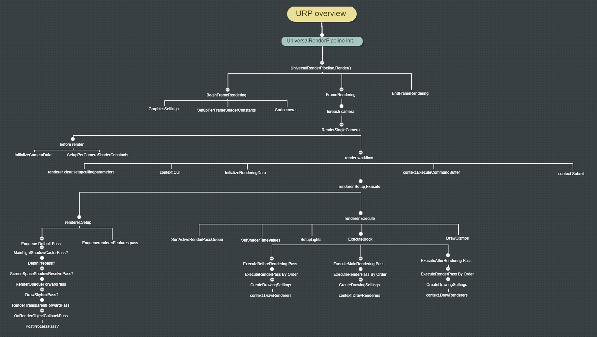

# URP Analysis

URP是unity推出的，用于替代传统build-in管线。该篇为阅读源码的笔记~

URP的入口文件为UniversalRenderPiplineAsset.cs,在该文件中，进行了一系列初始化操作,核心是CreatePipeline函数，创建了渲染管线，默认渲染的render为继承至ScriptableRenderer的ForwardRenderer，初始化默认渲染管线UniversalRenderPipeline。

# UniversalRenderPipeline

UniversalRenderPipeline首先初始化一系列渲染参数,如shader的全局变量等。

```
 public UniversalRenderPipeline(UniversalRenderPipelineAsset asset)
        {
            SetSupportedRenderingFeatures(); #some settings in editor mode

            PerFrameBuffer._GlossyEnvironmentColor = Shader.PropertyToID("_GlossyEnvironmentColor");
            PerFrameBuffer._SubtractiveShadowColor = Shader.PropertyToID("_SubtractiveShadowColor");

            PerFrameBuffer._Time = Shader.PropertyToID("_Time");
            PerFrameBuffer._SinTime = Shader.PropertyToID("_SinTime");
            PerFrameBuffer._CosTime = Shader.PropertyToID("_CosTime");
            PerFrameBuffer.unity_DeltaTime = Shader.PropertyToID("unity_DeltaTime");
            PerFrameBuffer._TimeParameters = Shader.PropertyToID("_TimeParameters");

            PerCameraBuffer._InvCameraViewProj = Shader.PropertyToID("_InvCameraViewProj");
            PerCameraBuffer._ScreenParams = Shader.PropertyToID("_ScreenParams");
            PerCameraBuffer._ScaledScreenParams = Shader.PropertyToID("_ScaledScreenParams");
            PerCameraBuffer._WorldSpaceCameraPos = Shader.PropertyToID("_WorldSpaceCameraPos");

            // Let engine know we have MSAA on for cases where we support MSAA backbuffer
            if (QualitySettings.antiAliasing != asset.msaaSampleCount)
                QualitySettings.antiAliasing = asset.msaaSampleCount;

            // For compatibility reasons we also match old LightweightPipeline tag.
            Shader.globalRenderPipeline = "UniversalPipeline,LightweightPipeline";

            Lightmapping.SetDelegate(lightsDelegate);

            CameraCaptureBridge.enabled = true;

            RenderingUtils.ClearSystemInfoCache();
        }
```

初始化完毕后，unity会每帧自动调用UniversalRenderPipeline的Render()函数

```
protected override void Render(ScriptableRenderContext renderContext, Camera[] cameras)
        {
            BeginFrameRendering(renderContext, cameras);

            GraphicsSettings.lightsUseLinearIntensity = (QualitySettings.activeColorSpace == ColorSpace.Linear);
            GraphicsSettings.useScriptableRenderPipelineBatching = asset.useSRPBatcher;
            SetupPerFrameShaderConstants();

            SortCameras(cameras);
            foreach (Camera camera in cameras)
            {
                BeginCameraRendering(renderContext, camera);
                RenderSingleCamera(renderContext, camera);

                EndCameraRendering(renderContext, camera);
            }

            EndFrameRendering(renderContext, cameras);
        }

```
```
void SortCameras(Camera[] cameras) // in UniversalRenderPipelineCore.cs
    {
        Array.Sort(cameras, (lhs, rhs) => (int)(lhs.depth - rhs.depth));
    }
```
BeginFrameRendering,BeginCameraRendering,EndCameraRendering,EndFrameRendering为几个标志性函数，表示某些步骤的开始或结束，render逻辑很简单，设置好每帧需要的shader参数，全局设置，线性空间等，然后按照Camera的深度排序相机，顺序渲染每个相机。关键函数RenderSingleCamera()。

## RenderSingleCamera

话不多说，代码先行~
```
 public static void RenderSingleCamera(ScriptableRenderContext context, Camera camera)
        {
            if (!camera.TryGetCullingParameters(IsStereoEnabled(camera), out var cullingParameters))
                return;

            var settings = asset; //UniversalRenderPipelineAsset
            UniversalAdditionalCameraData additionalCameraData = null;
            if (camera.cameraType == CameraType.Game || camera.cameraType == CameraType.VR)
                camera.gameObject.TryGetComponent(out additionalCameraData);

            InitializeCameraData(settings, camera, additionalCameraData, out var cameraData);
            SetupPerCameraShaderConstants(cameraData);

            ScriptableRenderer renderer = (additionalCameraData != null) ? additionalCameraData.scriptableRenderer : settings.scriptableRenderer;
            if (renderer == null)
            {
                Debug.LogWarning(string.Format("Trying to render {0} with an invalid renderer. Camera rendering will be skipped.", camera.name));
                return;
            }

            string tag = (asset.debugLevel >= PipelineDebugLevel.Profiling) ? camera.name: k_RenderCameraTag;
            CommandBuffer cmd = CommandBufferPool.Get(tag);
            using (new ProfilingSample(cmd, tag))
            {
                renderer.Clear();
                renderer.SetupCullingParameters(ref cullingParameters, ref cameraData);

                context.ExecuteCommandBuffer(cmd);
                cmd.Clear();


                var cullResults = context.Cull(ref cullingParameters);
                InitializeRenderingData(settings, ref cameraData, ref cullResults, out var renderingData);

                renderer.Setup(context, ref renderingData);
                renderer.Execute(context, ref renderingData);
            }

            context.ExecuteCommandBuffer(cmd);
            CommandBufferPool.Release(cmd);
            context.Submit();
        }
```
概括来看，RenderSingleCamera的逻辑也很简单，获取裁剪数据，获取相机的特殊设置（msaa，depthmap等），设置相机相关的shader全局参数（MVP矩阵等），从commandbufferpool中取一个cmd，然后调用asset中初始化的renderer，默认为forwardrenderer，接下来就开始渲染设置，提交渲染命令，结束当前相机渲染。

标准的unity渲染流程：

1. 清空renderer，setup裁剪数据，清空cmd
```
renderer.Clear();
renderer.SetupCullingParameters(ref cullingParameters, ref cameraData);
context.ExecuteCommandBuffer(cmd);
cmd.Clear();
```

2. 使用裁剪数据进行裁切
```
var cullResults = context.Cull(ref cullingParameters);
```

3. 初始化渲染数据
```
InitializeRenderingData(settings, ref cameraData, ref cullResults, out var renderingData);
```

4. renderer设置，执行
```
renderer.Setup(context, ref renderingData);
renderer.Execute(context, ref renderingData);
```

5. 执行cmd，释放cmd
```
context.ExecuteCommandBuffer(cmd);
CommandBufferPool.Release(cmd);
```

6. 提交渲染命令
```
context.Submit();
```

这里解释一下cmd，在gpu渲染中，每一次绘制都是一次命令，unity可以将多个绘制命令push到同一个commandbuffer中，比如我首先push一个绘制shadowmap的命令，之后push绘制不透明物体的命令，最后执行commandbuffer，那么gpu中就会先绘制阴影相关的pass，再绘制不透明物体pass。同理，我们也可以使用commandbuffer来定制我们想要的效果。

在InitializeRenderingData中，对可见光源进行了筛选，设置主光源，shadow相关参数（如shadow bias，shadow map resolution等），后处理lut，dynamicbatching。
重点分析renderer.Setup(context, ref renderingData)和renderer.Execute(context, ref renderingData)两个函数。


## ForwardRenderer&ScriptableRenderer

ForwardRenderer继承至ScriptableRenderer，ForwardRenderer的初始化代码如下:
```
 public ForwardRenderer(ForwardRendererData data) : base(data)
        {
            Material blitMaterial = CoreUtils.CreateEngineMaterial(data.shaders.blitPS);
            Material copyDepthMaterial = CoreUtils.CreateEngineMaterial(data.shaders.copyDepthPS);
            Material samplingMaterial = CoreUtils.CreateEngineMaterial(data.shaders.samplingPS);
            Material screenspaceShadowsMaterial = CoreUtils.CreateEngineMaterial(data.shaders.screenSpaceShadowPS);

            StencilStateData stencilData = data.defaultStencilState;
            m_DefaultStencilState = StencilState.defaultValue;
            m_DefaultStencilState.enabled = stencilData.overrideStencilState;
            m_DefaultStencilState.SetCompareFunction(stencilData.stencilCompareFunction);
            m_DefaultStencilState.SetPassOperation(stencilData.passOperation);
            m_DefaultStencilState.SetFailOperation(stencilData.failOperation);
            m_DefaultStencilState.SetZFailOperation(stencilData.zFailOperation);

            // Note: Since all custom render passes inject first and we have stable sort,
            // we inject the builtin passes in the before events.
            m_MainLightShadowCasterPass = new MainLightShadowCasterPass(RenderPassEvent.BeforeRenderingShadows);
            m_AdditionalLightsShadowCasterPass = new AdditionalLightsShadowCasterPass(RenderPassEvent.BeforeRenderingShadows);
            m_DepthPrepass = new DepthOnlyPass(RenderPassEvent.BeforeRenderingPrepasses, RenderQueueRange.opaque, data.opaqueLayerMask);
            m_ScreenSpaceShadowResolvePass = new ScreenSpaceShadowResolvePass(RenderPassEvent.BeforeRenderingPrepasses, screenspaceShadowsMaterial);
            m_ColorGradingLutPass = new ColorGradingLutPass(RenderPassEvent.BeforeRenderingOpaques, data.postProcessData);
            m_RenderOpaqueForwardPass = new DrawObjectsPass("Render Opaques", true, RenderPassEvent.BeforeRenderingOpaques, RenderQueueRange.opaque, data.opaqueLayerMask, m_DefaultStencilState, stencilData.stencilReference);
            m_CopyDepthPass = new CopyDepthPass(RenderPassEvent.BeforeRenderingOpaques, copyDepthMaterial);
            m_DrawSkyboxPass = new DrawSkyboxPass(RenderPassEvent.BeforeRenderingSkybox);
            m_CopyColorPass = new CopyColorPass(RenderPassEvent.BeforeRenderingTransparents, samplingMaterial);
            m_RenderTransparentForwardPass = new DrawObjectsPass("Render Transparents", false, RenderPassEvent.BeforeRenderingTransparents, RenderQueueRange.transparent, data.transparentLayerMask, m_DefaultStencilState, stencilData.stencilReference);
            m_OnRenderObjectCallbackPass = new InvokeOnRenderObjectCallbackPass(RenderPassEvent.BeforeRenderingPostProcessing);
            m_PostProcessPass = new PostProcessPass(RenderPassEvent.BeforeRenderingPostProcessing, data.postProcessData);
            m_FinalPostProcessPass = new PostProcessPass(RenderPassEvent.AfterRenderingPostProcessing, data.postProcessData);
            m_CapturePass = new CapturePass(RenderPassEvent.AfterRendering);
            m_FinalBlitPass = new FinalBlitPass(RenderPassEvent.AfterRendering, blitMaterial);
            // RenderTexture format depends on camera and pipeline (HDR, non HDR, etc)
            // Samples (MSAA) depend on camera and pipeline
            m_CameraColorAttachment.Init("_CameraColorTexture");
            m_CameraDepthAttachment.Init("_CameraDepthAttachment");
            m_DepthTexture.Init("_CameraDepthTexture");
            m_OpaqueColor.Init("_CameraOpaqueTexture");
            m_AfterPostProcessColor.Init("_AfterPostProcessTexture");
            m_ColorGradingLut.Init("_InternalGradingLut");
            m_ForwardLights = new ForwardLights();
        }
```
可以看到ForwardRenderer首先声明了一系列内置material，利用这些material初始化了fowarender中的pass，如m_MainLightShadowCasterPass，m_AdditionalLightsShadowCasterPass等，看pass的名字就知道这个pass是做什么事情的了。urp默认的渲染逻辑和build-in其实还是一致的，先画一遍shdowmap的pass，然后画opaque pass，skybox pass，transparent pass最后加一些post process pass。urp和build in 的区别就是，在传统管线中，这些过程是被封装起来的，想要在特定的步骤做其他事情会非常麻烦，但URP把全过程都暴露了出来，开发者可以定制自己想要的渲染流程，比如，是否需要m_MainLightShadowCasterPass，是用unity默认的shader渲染shadowmap，还是使用自己特殊的shader来支持半透明阴影等，输出的shadowmap格式也可以由自己控制，是8bit的灰度图还是32bit图亦或者其他，render texture的各个通道含义都可以由开发者来定义。

### ForwardRenderer.Setup()

接下来是Setup函数：
```
 public override void Setup(ScriptableRenderContext context, ref RenderingData renderingData)
        {
            Camera camera = renderingData.cameraData.camera;
            ref CameraData cameraData = ref renderingData.cameraData;
            RenderTextureDescriptor cameraTargetDescriptor = renderingData.cameraData.cameraTargetDescriptor;

            // Special path for depth only offscreen cameras. Only write opaques + transparents. 
            bool isOffscreenDepthTexture = camera.targetTexture != null && camera.targetTexture.format == RenderTextureFormat.Depth;
            if (isOffscreenDepthTexture)
            {
                ConfigureCameraTarget(BuiltinRenderTextureType.CameraTarget, BuiltinRenderTextureType.CameraTarget);

                for (int i = 0; i < rendererFeatures.Count; ++i)
                    rendererFeatures[i].AddRenderPasses(this, ref renderingData);

                EnqueuePass(m_RenderOpaqueForwardPass);
                EnqueuePass(m_DrawSkyboxPass);
                EnqueuePass(m_RenderTransparentForwardPass);
                return;
            }

            bool mainLightShadows = m_MainLightShadowCasterPass.Setup(ref renderingData);
            bool additionalLightShadows = m_AdditionalLightsShadowCasterPass.Setup(ref renderingData);
            bool resolveShadowsInScreenSpace = mainLightShadows && renderingData.shadowData.requiresScreenSpaceShadowResolve;

            // Depth prepass is generated in the following cases:
            // - We resolve shadows in screen space
            // - Scene view camera always requires a depth texture. We do a depth pre-pass to simplify it and it shouldn't matter much for editor.
            // - If game or offscreen camera requires it we check if we can copy the depth from the rendering opaques pass and use that instead.
            bool requiresDepthPrepass = renderingData.cameraData.isSceneViewCamera ||
                (cameraData.requiresDepthTexture && (!CanCopyDepth(ref renderingData.cameraData)));
            requiresDepthPrepass |= resolveShadowsInScreenSpace;

            // TODO: There's an issue in multiview and depth copy pass. Atm forcing a depth prepass on XR until
            // we have a proper fix.
            if (cameraData.isStereoEnabled && cameraData.requiresDepthTexture)
                requiresDepthPrepass = true;

            bool createColorTexture = RequiresIntermediateColorTexture(ref renderingData, cameraTargetDescriptor)
                                      || rendererFeatures.Count != 0;

            // If camera requires depth and there's no depth pre-pass we create a depth texture that can be read
            // later by effect requiring it.
            bool createDepthTexture = cameraData.requiresDepthTexture && !requiresDepthPrepass;
            bool postProcessEnabled = cameraData.postProcessEnabled;

            m_ActiveCameraColorAttachment = (createColorTexture) ? m_CameraColorAttachment : RenderTargetHandle.CameraTarget;
            m_ActiveCameraDepthAttachment = (createDepthTexture) ? m_CameraDepthAttachment : RenderTargetHandle.CameraTarget;
            bool intermediateRenderTexture = createColorTexture || createDepthTexture;
            
            if (intermediateRenderTexture)
                CreateCameraRenderTarget(context, ref cameraData);

            ConfigureCameraTarget(m_ActiveCameraColorAttachment.Identifier(), m_ActiveCameraDepthAttachment.Identifier());

            // if rendering to intermediate render texture we don't have to create msaa backbuffer
            int backbufferMsaaSamples = (intermediateRenderTexture) ? 1 : cameraTargetDescriptor.msaaSamples;
            
            if (Camera.main == camera && camera.cameraType == CameraType.Game && camera.targetTexture == null)
                SetupBackbufferFormat(backbufferMsaaSamples, renderingData.cameraData.isStereoEnabled);
            
            for (int i = 0; i < rendererFeatures.Count; ++i)
            {
                rendererFeatures[i].AddRenderPasses(this, ref renderingData);
            }

            int count = activeRenderPassQueue.Count;
            for (int i = count - 1; i >= 0; i--)
            {
                if(activeRenderPassQueue[i] == null)
                    activeRenderPassQueue.RemoveAt(i);
            }
            bool hasAfterRendering = activeRenderPassQueue.Find(x => x.renderPassEvent == RenderPassEvent.AfterRendering) != null;

            if (mainLightShadows)
                EnqueuePass(m_MainLightShadowCasterPass);

            if (additionalLightShadows)
                EnqueuePass(m_AdditionalLightsShadowCasterPass);

            if (requiresDepthPrepass)
            {
                m_DepthPrepass.Setup(cameraTargetDescriptor, m_DepthTexture);
                EnqueuePass(m_DepthPrepass);
            }

            if (resolveShadowsInScreenSpace)
            {
                m_ScreenSpaceShadowResolvePass.Setup(cameraTargetDescriptor);
                EnqueuePass(m_ScreenSpaceShadowResolvePass);
            }

            if (postProcessEnabled)
            {
                m_ColorGradingLutPass.Setup(m_ColorGradingLut);
                EnqueuePass(m_ColorGradingLutPass);
            }

            EnqueuePass(m_RenderOpaqueForwardPass);

            if (camera.clearFlags == CameraClearFlags.Skybox && RenderSettings.skybox != null)
                EnqueuePass(m_DrawSkyboxPass);

            // If a depth texture was created we necessarily need to copy it, otherwise we could have render it to a renderbuffer
            if (createDepthTexture)
            {
                m_CopyDepthPass.Setup(m_ActiveCameraDepthAttachment, m_DepthTexture);
                EnqueuePass(m_CopyDepthPass);
            }

            if (renderingData.cameraData.requiresOpaqueTexture)
            {
                // TODO: Downsampling method should be store in the renderer isntead of in the asset.
                // We need to migrate this data to renderer. For now, we query the method in the active asset.
                Downsampling downsamplingMethod = UniversalRenderPipeline.asset.opaqueDownsampling;
                m_CopyColorPass.Setup(m_ActiveCameraColorAttachment.Identifier(), m_OpaqueColor, downsamplingMethod);
                EnqueuePass(m_CopyColorPass);
            }

            EnqueuePass(m_RenderTransparentForwardPass);
            EnqueuePass(m_OnRenderObjectCallbackPass);

            bool afterRenderExists = renderingData.cameraData.captureActions != null ||
                                     hasAfterRendering;

            bool requiresFinalPostProcessPass = postProcessEnabled &&
                                     renderingData.cameraData.antialiasing == AntialiasingMode.FastApproximateAntialiasing;

            // if we have additional filters
            // we need to stay in a RT
            if (afterRenderExists)
            {
                bool willRenderFinalPass = (m_ActiveCameraColorAttachment != RenderTargetHandle.CameraTarget);
                // perform post with src / dest the same
                if (postProcessEnabled)
                {
                    m_PostProcessPass.Setup(cameraTargetDescriptor, m_ActiveCameraColorAttachment, m_AfterPostProcessColor, m_ActiveCameraDepthAttachment, m_ColorGradingLut, requiresFinalPostProcessPass, !willRenderFinalPass);
                    EnqueuePass(m_PostProcessPass);
                }

                //now blit into the final target
                if (m_ActiveCameraColorAttachment != RenderTargetHandle.CameraTarget)
                {
                    if (renderingData.cameraData.captureActions != null)
                    {
                        m_CapturePass.Setup(m_ActiveCameraColorAttachment);
                        EnqueuePass(m_CapturePass);
                    }

                    if (requiresFinalPostProcessPass)
                    {
                        m_FinalPostProcessPass.SetupFinalPass(m_ActiveCameraColorAttachment);
                        EnqueuePass(m_FinalPostProcessPass);
                    }
                    else
                    {
                        m_FinalBlitPass.Setup(cameraTargetDescriptor, m_ActiveCameraColorAttachment);
                        EnqueuePass(m_FinalBlitPass);
                    }
                }
            }
            else
            {
                if (postProcessEnabled)
                {
                    if (requiresFinalPostProcessPass)
                    {
                        m_PostProcessPass.Setup(cameraTargetDescriptor, m_ActiveCameraColorAttachment, m_AfterPostProcessColor, m_ActiveCameraDepthAttachment, m_ColorGradingLut, true, false);
                        EnqueuePass(m_PostProcessPass);
                        m_FinalPostProcessPass.SetupFinalPass(m_AfterPostProcessColor);
                        EnqueuePass(m_FinalPostProcessPass);
                    }
                    else
                    {
                        m_PostProcessPass.Setup(cameraTargetDescriptor, m_ActiveCameraColorAttachment, RenderTargetHandle.CameraTarget, m_ActiveCameraDepthAttachment, m_ColorGradingLut, false, true);
                        EnqueuePass(m_PostProcessPass);
                    }
                }
                else if (m_ActiveCameraColorAttachment != RenderTargetHandle.CameraTarget)
                {
                    m_FinalBlitPass.Setup(cameraTargetDescriptor, m_ActiveCameraColorAttachment);
                    EnqueuePass(m_FinalBlitPass);
                }
            }
        }
```

这段代码非常长，涉及的内容也很多，一点点来看~

```
 bool isOffscreenDepthTexture = camera.targetTexture != null && camera.targetTexture.format == RenderTextureFormat.Depth;
    if (isOffscreenDepthTexture)
    {
        ConfigureCameraTarget(BuiltinRenderTextureType.CameraTarget, BuiltinRenderTextureType.CameraTarget);

        for (int i = 0; i < rendererFeatures.Count; ++i)
            rendererFeatures[i].AddRenderPasses(this, ref renderingData);

        EnqueuePass(m_RenderOpaqueForwardPass);
        EnqueuePass(m_DrawSkyboxPass);
        EnqueuePass(m_RenderTransparentForwardPass);
        return;
    }
```
首先，如果渲染的相机是深度相机，有自己的RT，那么，Setup之后的过程都不会执行，默认会执行3个pass，不透明物体，天空球，和半透明物体。

```
public void EnqueuePass(ScriptableRenderPass pass)
    {
        m_ActiveRenderPassQueue.Add(pass);
    }
```
这里涉及到rendererFeatures，这个其实就是URP开放给开发者自定义pass的接口，可以简单理解为这是对commandbuffer的一个封装，它通过用户指定layer来剔除objects，通过用户指定material来再渲染一遍filter后的object，rendererFeature实际调用的就是renderobjects，给objects赋予指定material再多渲染一个pass。
同时，URP默认是不支持多pass渲染的，开发者就需要通过rendererfeature来实现多pass渲染，这也是URP和build-in的区别之一。


```
bool mainLightShadows = m_MainLightShadowCasterPass.Setup(ref renderingData);
bool additionalLightShadows = m_AdditionalLightsShadowCasterPass.Setup(ref renderingData);
```
看名字可以猜测这两个pass一个是负责主光源阴影投射，另一个是次光源的阴影投射。这俩主要是判断当前光源是否产生阴影，如果返回值为true，则push相关pass。
```
if (mainLightShadows)
    EnqueuePass(m_MainLightShadowCasterPass);

if (additionalLightShadows)
    EnqueuePass(m_AdditionalLightsShadowCasterPass);
```

剩下的代码都遵循同样的逻辑：按需增加。如果需要depthpass，那就push一个depthpass，如果当前相机渲染天空球，那就push一个m_DrawSkyboxPass，所以一路看下来，forwardrender中固定会push的pass只有一下几个：
```
EnqueuePass(m_RenderOpaqueForwardPass);
EnqueuePass(m_RenderTransparentForwardPass);
EnqueuePass(m_OnRenderObjectCallbackPass);
```
第三个只是一个回调pass，根据unity官方文档解释：“为 MonoBehaviour 脚本调度 OnRenderObject 回调的调用。此方法会触发 MonoBehaviour.OnRenderObject。调用此函数可从渲染管线发出 OnRenderObject 回调。通常应在摄像机渲染场景之后，但是在添加后期处理之前调用此函数。”
所以最简单的forwardrender就是一个不透明pass，一个透明pass。

### ForwardRenderer.Execute()

ForwardRenderer本身并未实现Execute()函数，所以脚本会自动调用ScriptableRenderer的Execute()函数。
```
public void Execute(ScriptableRenderContext context, ref RenderingData renderingData)
    {
        Camera camera = renderingData.cameraData.camera;
        SetCameraRenderState(context, ref renderingData.cameraData);

        SortStable(m_ActiveRenderPassQueue);

        // Cache the time for after the call to `SetupCameraProperties` and set the time variables in shader
        // For now we set the time variables per camera, as we plan to remove `SetupCamearProperties`.
        // Setting the time per frame would take API changes to pass the variable to each camera render.
        // Once `SetupCameraProperties` is gone, the variable should be set higher in the call-stack.
   		float time = Time.time;
        float deltaTime = Time.deltaTime;
        float smoothDeltaTime = Time.smoothDeltaTime;
        SetShaderTimeValues(time, deltaTime, smoothDeltaTime);

        // Upper limits for each block. Each block will contains render passes with events below the limit.
        NativeArray<RenderPassEvent> blockEventLimits = new NativeArray<RenderPassEvent>(k_RenderPassBlockCount, Allocator.Temp);
        blockEventLimits[RenderPassBlock.BeforeRendering] = RenderPassEvent.BeforeRenderingPrepasses;
        blockEventLimits[RenderPassBlock.MainRendering] = RenderPassEvent.AfterRenderingPostProcessing;
        blockEventLimits[RenderPassBlock.AfterRendering] = (RenderPassEvent)Int32.MaxValue;

        NativeArray<int> blockRanges = new NativeArray<int>(blockEventLimits.Length + 1, Allocator.Temp);
        FillBlockRanges(blockEventLimits, blockRanges);
        blockEventLimits.Dispose();

        SetupLights(context, ref renderingData);

        // Before Render Block. This render blocks always execute in mono rendering.
        // Camera is not setup. Lights are not setup.
        // Used to render input textures like shadowmaps.
        ExecuteBlock(RenderPassBlock.BeforeRendering, blockRanges, context, ref renderingData);

        /// Configure shader variables and other unity properties that are required for rendering.
        /// * Setup Camera RenderTarget and Viewport
        /// * VR Camera Setup and SINGLE_PASS_STEREO props
        /// * Setup camera view, projection and their inverse matrices.
        /// * Setup properties: _WorldSpaceCameraPos, _ProjectionParams, _ScreenParams, _ZBufferParams, unity_OrthoParams
        /// * Setup camera world clip planes properties
        /// * Setup HDR keyword
        /// * Setup global time properties (_Time, _SinTime, _CosTime)
        bool stereoEnabled = renderingData.cameraData.isStereoEnabled;
        context.SetupCameraProperties(camera, stereoEnabled);

        // Override time values from when `SetupCameraProperties` were called.
        // They might be a frame behind.
        // We can remove this after removing `SetupCameraProperties` as the values should be per frame, and not per camera.
        SetShaderTimeValues(time, deltaTime, smoothDeltaTime);

        if (stereoEnabled)
            BeginXRRendering(context, camera);

        // In this block main rendering executes.
        ExecuteBlock(RenderPassBlock.MainRendering, blockRanges, context, ref renderingData);

        DrawGizmos(context, camera, GizmoSubset.PreImageEffects);

        // In this block after rendering drawing happens, e.g, post processing, video player capture.
        ExecuteBlock(RenderPassBlock.AfterRendering, blockRanges, context, ref renderingData);

        if (stereoEnabled)
            EndXRRendering(context, camera);

        DrawGizmos(context, camera, GizmoSubset.PostImageEffects);

        //if (renderingData.resolveFinalTarget)
            InternalFinishRendering(context);
        blockRanges.Dispose();
    }
```
Execute()逻辑很简单，首先将setup中enqueue的pass根据renderPassEvent排序，然后设置shader time，灯光等信息。Execute()分为了三个阶段：
```
ExecuteBlock(RenderPassBlock.BeforeRendering, blockRanges, context, ref renderingData);
// In this block main rendering executes.
ExecuteBlock(RenderPassBlock.MainRendering, blockRanges, context, ref renderingData);
// In this block after rendering drawing happens, e.g, post processing, video player capture.
ExecuteBlock(RenderPassBlock.AfterRendering, blockRanges, context, ref renderingData);
```
ExecuteBlock按顺序调用renderpassqueue中的pass
```
void ExecuteBlock(int blockIndex, NativeArray<int> blockRanges,
    ScriptableRenderContext context, ref RenderingData renderingData, bool submit = false)
{
    int endIndex = blockRanges[blockIndex + 1];
    for (int currIndex = blockRanges[blockIndex]; currIndex < endIndex; ++currIndex)
    {
        var renderPass = m_ActiveRenderPassQueue[currIndex];
        ExecuteRenderPass(context, renderPass, ref renderingData);
    }

    if (submit)
        context.Submit();
}
```

ExecuteRenderPass阅读下来其实就只做了一件事：确定pass的rendertarget是RT还是Framebuffer,如果和当前生效的rendertarget不一致，就更新rendertarget，然后调用renderPass.Execute(context, ref renderingData)

不同renderpass的Execute方法实现不一，这里对比DrawObjectsPass和DepthOnlyPass
```
//DrawObjectsPass
public override void Execute(ScriptableRenderContext context, ref RenderingData renderingData)
{
    CommandBuffer cmd = CommandBufferPool.Get(m_ProfilerTag);
    using (new ProfilingSample(cmd, m_ProfilerTag))
    {
        context.ExecuteCommandBuffer(cmd);
        cmd.Clear();

        Camera camera = renderingData.cameraData.camera;
        var sortFlags = (m_IsOpaque) ? renderingData.cameraData.defaultOpaqueSortFlags : SortingCriteria.CommonTransparent;
        var drawSettings = CreateDrawingSettings(m_ShaderTagIdList, ref renderingData, sortFlags);
        context.DrawRenderers(renderingData.cullResults, ref drawSettings, ref m_FilteringSettings, ref m_RenderStateBlock);

        // Render objects that did not match any shader pass with error shader
        RenderingUtils.RenderObjectsWithError(context, ref renderingData.cullResults, camera, m_FilteringSettings, SortingCriteria.None);
    }
    context.ExecuteCommandBuffer(cmd);
    CommandBufferPool.Release(cmd);
}

//DepthOnlyPass
public override void Execute(ScriptableRenderContext context, ref RenderingData renderingData)
{
    CommandBuffer cmd = CommandBufferPool.Get(m_ProfilerTag);
    using (new ProfilingSample(cmd, m_ProfilerTag))
    {
        context.ExecuteCommandBuffer(cmd);
        cmd.Clear();
        var sortFlags = renderingData.cameraData.defaultOpaqueSortFlags;
        var drawSettings = CreateDrawingSettings(m_ShaderTagId, ref renderingData, sortFlags);
        drawSettings.perObjectData = PerObjectData.None;

        context.DrawRenderers(renderingData.cullResults, ref drawSettings, ref m_FilteringSettings);

    }
    context.ExecuteCommandBuffer(cmd);
    CommandBufferPool.Release(cmd);
}
```

可以看到，两个pass只有细微的区别，DrawObjectsPass根据renderingData绘制透明或者不透明物体，而DepthOnlyPass绘制默认的不透明物体
DrawObjectsPass生效的m_ShaderTagIdList包含以下三个tag的shader：
```
m_ShaderTagIdList.Add(new ShaderTagId("UniversalForward"));
m_ShaderTagIdList.Add(new ShaderTagId("LightweightForward"));
m_ShaderTagIdList.Add(new ShaderTagId("SRPDefaultUnlit"));
```
而DepthOnlyPass只对"DepthOnly"tag生效
```
ShaderTagId m_ShaderTagId = new ShaderTagId("DepthOnly");
```

因为URP默认是不支持多pass的，所以在论坛上也看到有人建议，如果要做双pass或者三pass效果，可以一次给pass打上UniversalForward，LightweightForward和SRPDefaultUnlit的tag，也算是利用默认的管线变相实现多pass了。确实，感觉挺鬼才的hhhhhh~
那么至此，整个URP的工作流程已经梳理完成了-3-

