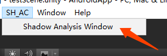
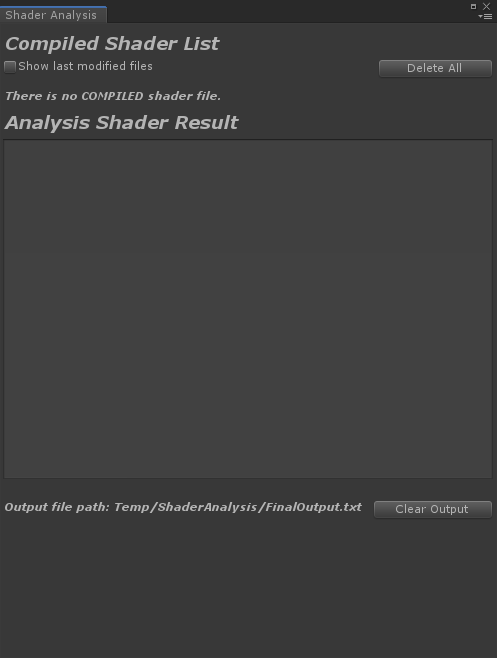
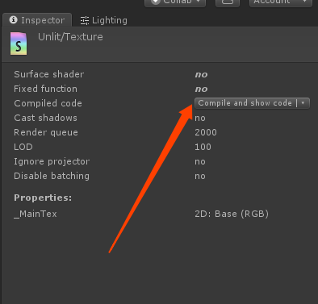
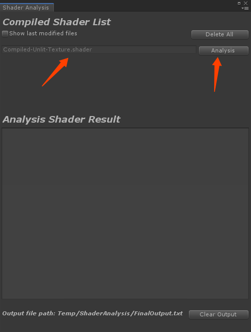
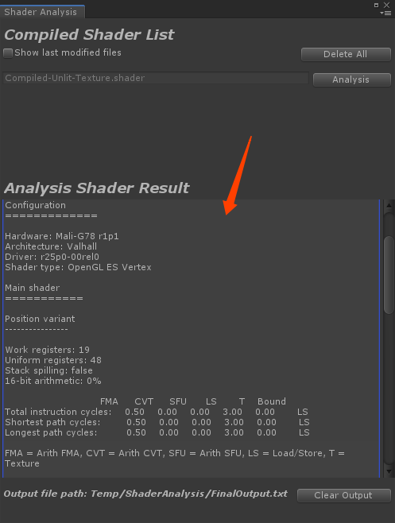

# ShaderAnalysis 使用说明

## 简介

ShaderAnalysis是基于ARM Mali Offline Compiler制作的Unity插件，使用package manager导入项目中。插件要求系统已安装Arm Mobile Studio，[下载链接](https://developer.arm.com/tools-and-software/graphics-and-gaming/arm-mobile-studio/downloads)

## 导入插件
打开项目工程目录下Pakages/manifest.json文件，在dependencies中加入"com.shac.shaderanalysis":"https://<span>github.com/Alunice/TaTa.git?path=/com.shac.shaderanalysis"，详细使用方式见[upm-git官方文档](https://docs.unity3d.com/Manual/upm-git.html)，有时unity hub对git支持不好,这时可以选择本地磁盘导入的方式，在package manager中选择 add form disk或直接配置manifest.json文件，[upm-localpath官方文档](https://docs.unity3d.com/Manual/upm-localpath.html)。

## 使用方式
插件成功导入之后，在上方菜单栏中点击SH_AC/Shader Analysis Window，流程图见最下方。


------------------------

# ShaderAnalysis Manual

## Introducion

ShaderAnalysis is a unity Plug-in based on ARM Mali Offlilne Compiler,imported to project by Package Manager.Arm Mobile Studio need to be installed first,([download](https://developer.arm.com/tools-and-software/graphics-and-gaming/arm-mobile-studio/downloads))

## Import Plug-in
Open the project's manifest.json file.json,you can delcare Git dependencies in it.

**Git URLs example**
```
{
	"dependencies":{
		...
		"com.shac.shaderanalysis": "https://github.com/Alunice/TaTa.git?path=/com.shac.shaderanalysis",
		...
	}
}


```
You can check the official document for details ([upm-git](https://docs.unity3d.com/Manual/upm-git.html)).
For some reason the unity hub doesn't support git well,so you can choose import form disk.Here is the official document ([upm-localpath](https://docs.unity3d.com/Manual/upm-localpath.html)).


## Operation Process









