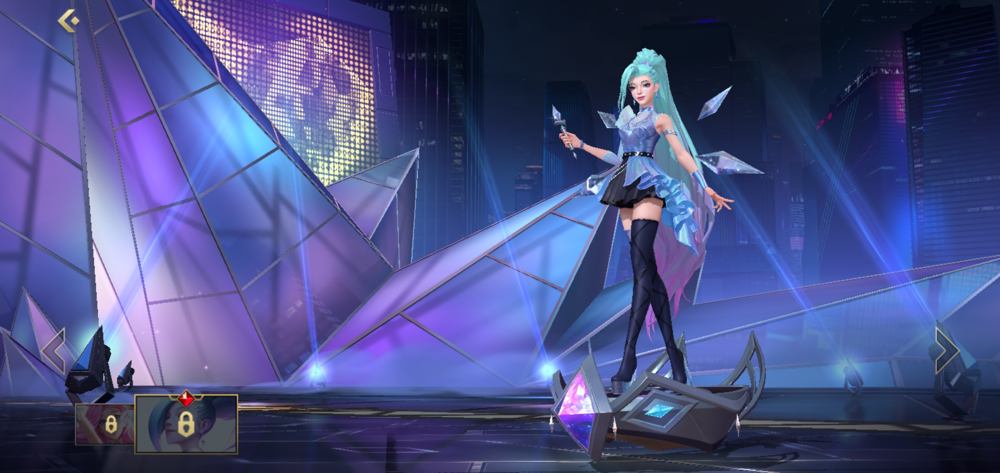
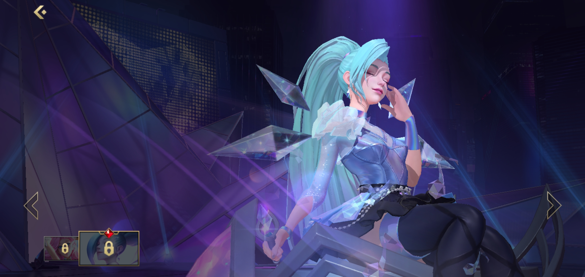
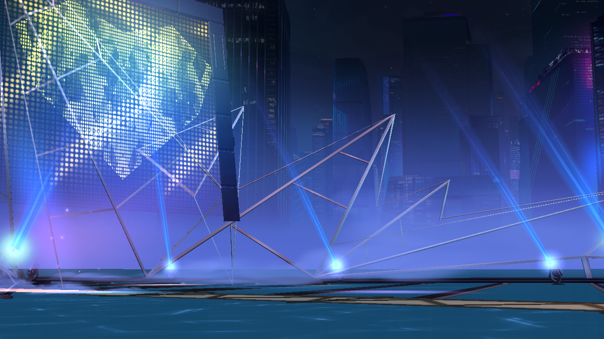
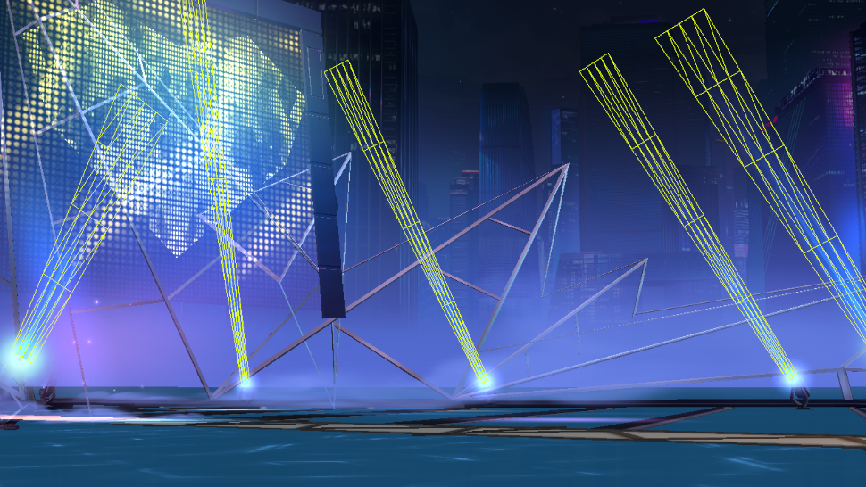
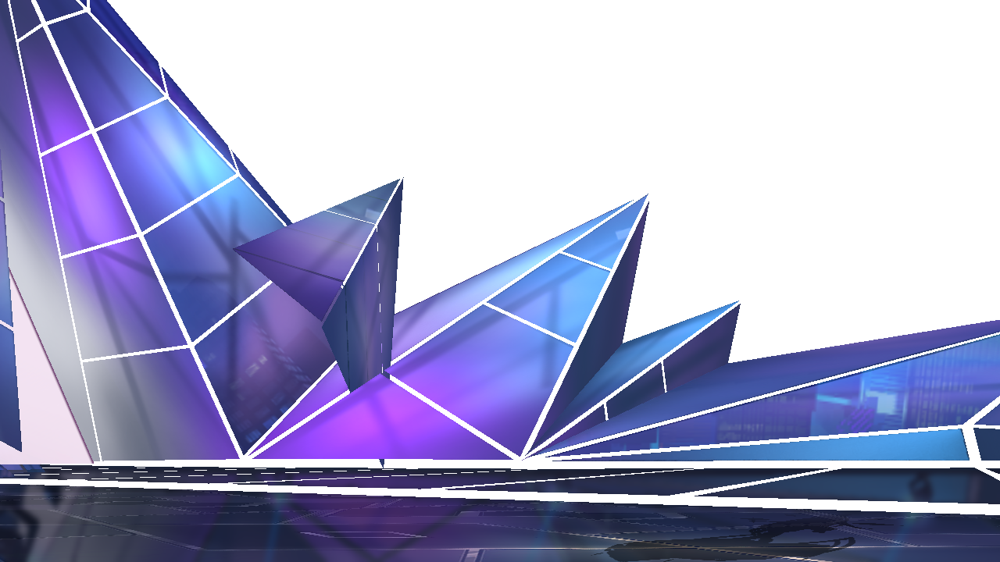
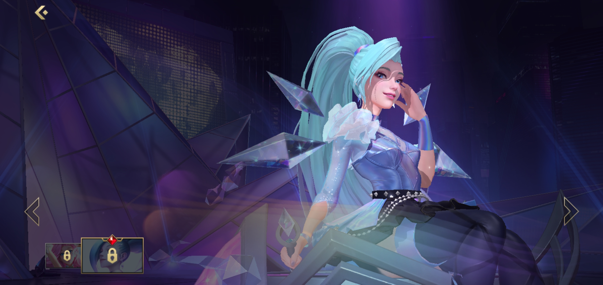
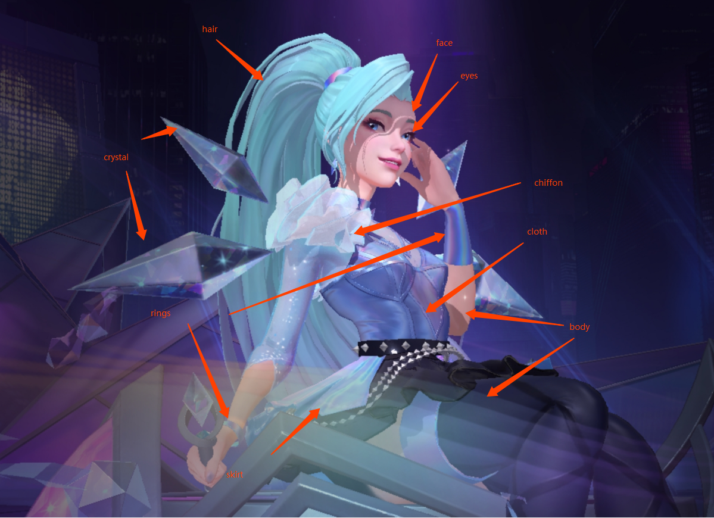
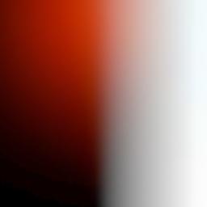
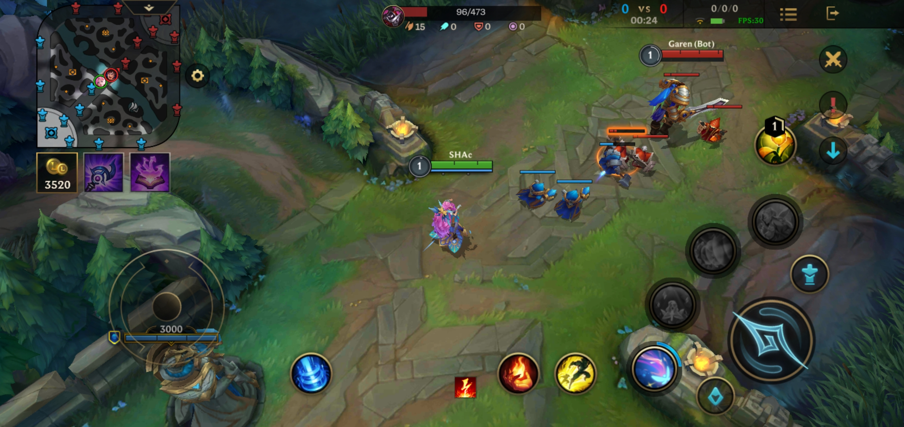
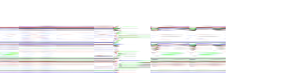

# Graphic Analysis-League of Legends: Wild Rift
LOL手游上线，代表着riot game正式进入PBR渲染。打了一个月排外赛，两次黄金晋级失败，怒删游戏。但想了想seraphine那么好看，得先把她从包里头拿出来再卸载，于是乎费了老大功夫弄到了apk重新开始拆包之旅。
既然拆包，就想着顺带分析一下lol的图形渲染吧，看了下知乎，好像没有很深入的渲染分析帖，于是开始动笔。
直到分析报告做了一半，在知乎上面刷到了[这篇文章](https://zhuanlan.zhihu.com/p/286836840)，一口老血就喷了出来，但都开始写了，总要有始有终，Lute Li大佬的文章也帮我省去了很多翻译glsl的工作（恨自己没早点看到orz）。

所以，本文会从更为整体的角度去分析lol手游英雄展示界面的渲染表现，在技术分析的同时，表达一些自己对产品的看法。（是时候展现我苦练多日的直男审美了）

预先声明，本人不以盈利为目的使用相关资源，仅供学习交流使用，且本文涉及到的游戏内角色资源都经过处理。

## Scene:Champion

<video width="640" height="360" controls>
  <source src="./res/kda_dance.mp4" type="video/mp4">
</video>

视频码率被压缩得很厉害，大家可以去游戏内或者在网上找一些高码率的视频看吧~




可以看出来，riot的艺术家们还是相当给力的，角色开场舞蹈动作非常干净且有力量，镜头切换和角色之间的互动也是相当有感染力的，在很大程度上，还原了端游带给玩家的体验，这点在国内其他产品中是非常少见的。角色的许多小动作，表情都能很真实的反映人物性格，这一点在玩家情感带入中尤为重要，至此，角色不再只是一个单纯的模型，玩家可以注入自己的情感与之共鸣。当然，代价就是制作成本可能会成倍增加。

整个场景一共有165左右drawcall，使用了95张texture（19MB左右）以及7张render target（18MB左右），单角色展示模型就达到了三万面以上，用到的贴图基本都是1K，法线贴图甚至使用了2K的精度。从资源量的角度来看，已经算是精度很高的了。因为没有反编译CPU端的代码，所以不清楚LOL场景的加载方式，lol手游基本上做到了英雄展示界面的无缝切换，资源的预加载和卸载应该是做了一些处理的，毕竟如丝般顺滑，基本感觉不到卡顿。

## Background



seraphine kda皮肤的展示界面是一个类似于舞台的场景，场景的“灯光”，“雾效”非常丰富，大屏上的像素点爱心，展现现代的科技感之余，又带了一丝可爱和调皮。灯光和雾效之所以打上引号，是因为这些都是通过一些面片的trick方式实现的。

首先是最远处的背景，它是通过一张贴图贴在一个圆柱体上来模拟的。游戏默认会开起重力感应，随着手机屏幕移动，镜头也会跟随手机进行一些轻微的移动（以至于不足以大幅度改变相机视角）。

中景处的雾效则为面片+uv动画的方式实现，雾效分为两种，一种是由低往高衰减的淡蓝色的“高度雾”，用一个mesh+gradient图就可以实现。另一种是白色的类似舞台干冰效果的雾，这种是通过uv动画的方式实现雾气飘动的效果。因为场景“光源”比较多，所以riot的美术还制作了许多光晕直接盖在场景中，来模拟光线穿过雾气的散射效果。再加上摄像机可以基本认为是不能移动的，在镜头限定的情况下，通过面片方式模拟光和雾效就不容易穿帮。




射灯也是通过底下铺一层光片，再往上头盖一层高亮的射线mesh。这样一套做下来整个场景的overdraw应该也会非常高，不过由于场景较小，玩家视角限定，场景带来的开销也就属于可控范围内了，在可接受范围内去堆效果感觉也还好。



这个奇奇怪怪的东西我不知道叫什么（边框在上一张图），外表可能是玻璃或者一些特殊材料，上面有一些边框投射的阴影，这些阴影就是直接画在贴图上的了，一些像灯光散射的效果也是直接画在了贴图上面，同时，这种材料还会有反射的效果。riot在制作场景时，给不同的物体制作了不同的reflection map，就拿这个物体来说，它表面的reflection map和边框的reflection map就是不同的贴图。

对于一些反射较强的物体：如金属，宝石，水晶等，riot是通过matcap来实现反射效果的。matcap的原理就不展开说了，大家可以自行查阅相关资料，文章开头提到的文章内也有说明。这里可以提一点的是，reflection map一般是一个有六张贴图的cubemap（环境贴图skybox），或者通过一张全景图来生成。但因为展示界面内摄像机永远是朝向正前方，渲染物体的面也都是正面朝向相机的，所以viewdir和reflectdir范围都是确定好的。大家可以想象在你正前方有一个球面的镜子，你在这面镜子上看到的内容就是你当前视角通过反射所能看到的全部内容了。所以，原本需要一个六面的cubemap才能描述的环境贴图，在这种情况下，用一张预生成的matcap就能完成采样。

## Champion


角色渲染总体看下来属于风格化的PBR渲染，riot多年的美术迭代，让他们形成了一套全球化的美术风格，在欧美和亚洲审美之间找到了平衡。和端游比起来，手游至少已经是PBR渲染了，在材质方面，头发的各向异性高光，皮肤的SSS反射，金属，水晶，霓虹布料都得到了不错的表现效果。个人感觉从写实到NPR渲染，艺术家们发挥的作用会逐渐重要，TA做的效果最终还是要回归到艺术家们手中调优。

根据Lute Li大佬的文章，LOL手游最终选用的是unity第二级的brdf函数，各级brdf函数如下：

* brdf1：基于迪士尼brdf
* brdf2：brdf1优化版
* brdf3：预烘焙NHRoughness

brdf1效果最好，性能最差，brdf2相当于取了个折中，在兼顾性能的同时尽可能提升美术表现效果。brdf相关过程就不展开了，我们大概梳理一下角色渲染的过程。


角色渲染拆分

贴图资源依次为：

* 1K base color map
* 2k normal map
* 1k metallic map
* 512 occlusion map
* 1k shadow map
* 256 ssslut
* 64 reflection matcap

个别资源可能还会用到emission map。

如角色拆分所示，riot将角色拆分成不同材质分开渲染，从制作流程来看，选择的是用同一shader的不同变体，以满足不同材质的一些特殊表现（如皮肤的SSS）。
下面开始pbr流程啦，傻傻分不清金属和非金属性质的可以看龚大的[这篇文章](https://zhuanlan.zhihu.com/p/21961722)

首先，各个材质的abledo制作在了同一张贴图中，basecolor贴图中存储了rbga信息，薄纱chiffon材质的透明度也写在了里头。metallic map比较特殊，R通道存储金属度，G通道存储光滑度，B通道只在皮肤相关shader中生效，参与皮肤渲染时作为曲率采样ssslut。这里有一个比较奇怪的处理，除了皮肤外，角色黑色的裙摆，腿上的丝袜使用的也是这个shader，唯一区别是通过metallic map的b通道的值，来区分渲染的是皮肤还是丝绸：
```
skinorsilk = 0.0199999996<metallic.b;
 if(skinorsilk){
 		...
        texture(_SssLut,ssslutuv);
        ...
    } else {
        ...
        silk diffuse calculate
        ...
    }
```
可能riot的艺术家们认为，丝绸和皮肤除了ssslut外，其他诸如双层高光等性质都十分相似，故而合并在一起渲染了。

提到了ssslut，那就简单解释一下3S查找表是什么。



SSS look up texture

光与表面的交互主要为反射和散射，其中，皮肤的散射会更为特殊。简单来说，就是光线在进入皮肤内部后，经过一系列折射再从另一点射出，射出光线的光通量会改变，也就是颜色、亮度会有不同。ssslut就是一张预积分图，纵坐标y表示入射点曲率的倒数，横坐标为法线N点乘光线入射方向L的值NdotL，采样结果表示该点的光通量。用美术的话来说就是会产生明暗交界线附近颜色会更加饱和这一现象。可以看到，角色的下巴，鼻翼，耳尖等地方，略微泛红的SSS效果会比较明显。

occlusion map使用了R，G两个通道，分别控制环境光遮蔽强弱以及shadow attenuation。

角色阴影实现单独使用了1K精度的shadow map，再配合occlusion map的g通道控制阴影强弱，glsl代码中有根据灯光距离衰减相关的代码，但不确定是不是pcss，看了几个英雄，并没有看见明显的pcss虚实效果（也可能是我眼瞎）。

reflection matcap原理作用如前面所述。

其中有一些特殊的面料，如霓虹反射的布料，半透明薄纱。霓虹反射有些颜色是本身就画在了贴图上面，高光部分使用了一张lut贴图去做color grading。半透明薄纱表现效果一般，并未做多层半透效果处理，目测只是简单的cull back + Fresnel，来实现单层半透和边缘较实的表现。

头发渲染和布料，皮肤不同，使用的是比较常见的头发制作方式：tangent map控制高光方向和形状，一张gloss map控制光泽表现，一个occlusion map控制双层高光的亮度。对于像seraphine这样发量惊人的角色，头发的面数都超过了一万面，也是非常高的了。

总结下来，roit在场景制作方面下了非常大的功夫，尤其是KDA系列的舞台场景，为了达到舞台效果，使用了非常多的trick方式提升美术表现，这带来的弊端就是场景overdraw会非常高，对比峡谷战斗场景，英雄展示界面渲染方面的开销会更大，手机发热明显。角色渲染材质方面使用了PBR渲染，以常见的BRDF为基础，增加了关于皮肤SSS散射效果，高光反射方面也使用matcap代替传统的reflect采样等。角色材质区分度很高，金属，布料，霓虹面料，半透明薄纱也都得到了不错的表现。值得称赞的是riot的动作和美术风格，尤其是动作，非常有表现力，烘托角色性格。

## Summoner's Canyon

召唤师峡谷就简单介绍下吧，因为确实很简单，这里重要的是玩法，而不是画面表现（虽然感觉也足够吊打农药了）。



首先，整个对线期场景的渲染面数在3-4万面的样子，也就一个英雄展示界面高模的面数（所以可以看出在展示界面riot花了多大功夫在渲染上），5V5团战估计也就不到十万面吧，玩家控制的英雄面数相对要高一点，三千面左右，其他英雄在一两千面的样子。小兵使用了GPU Instance，模型500面上下。场景大部分为模型，草丛使用面片的方式插在场景上。河道是画在贴图上的，上面盖了层uv动画模拟水面流动效果，但水面与玩家没有互动，不会有涟漪啊啥的。整个场景都是预烘焙lightmap，unlit模型，无光照。阴影就使用了planar shadow，把人物压在一个平面上做阴影，截帧可以看见明显的重叠高暗部分（riot你好歹做个stencil呗）。DC 100+，整体看下来技术、渲染都比较简单，对机器性能要求不高。



gpu instance animation


这是一张view mask贴图，应该是每帧更新控制视野用的，

所以重点其实是在逻辑层面，这边没有去逆向cpu端的代码，只能凭经验瞎叨叨下。个人感觉MOBA类游戏的战斗逻辑会更为复杂一些，除开逻辑复杂外，另一个难点应该在动作匹配融合方面，不过因为我没做过MOBA类的战斗开发，所以也不太能确定其具体的复杂程度和制作难度。


## 一些碎碎念
anyway，听说riot做lol手游是木有ta滴，那只能说，riot艺术家大大们牛逼（破音）。以前觉得TA是平衡协调技术和美术之间的桥梁，和两边都能说上话，但现在感觉，TA更像从技术的角度服务于美术同学，帮助艺术家们实现他们充满创意和表现力的构想。从团队的角度看就是去提升整体的制作水平，工作效率。不同于引擎或者图程大佬，TA对待新技术的视角更像是一名美术：如何利用新技术提升美术表现改进玩法增加互动。在美术方面，又更多的是从程序员的角度去分析材质表现，制作流程，性能优化，trick大法无敌！

有一说一，作为在工业界苦苦学习的小菜鸡，看singgraph或者GDC里头的论文，对学术界以及工业界一线最前沿的大佬真的很佩服，这些人脑子是怎么构成的啊。害，UE4.26发布啦，UE5也在路上了，感觉mobile和PC的差距越来越大了sigh~

