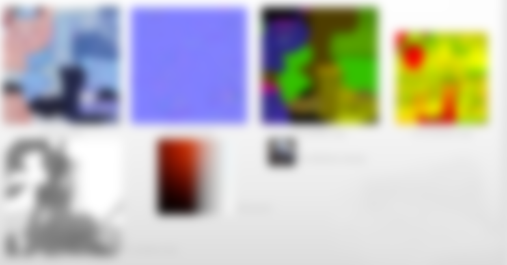

# Graphic Analysis-League of Legends: Wild Rift
LOL手游上线，代表着riot game正式进入PBR渲染。打了一个月排外赛，两次黄金晋级失败，怒删游戏。但想了想seraphine那么好看，得先把她从包里头拿出来再卸载，于是乎费了老大功夫弄到了apk重新开始拆包之旅。
既然拆包，就想着顺带分析一下lol的图形渲染吧，看了下知乎，好像没有很深入的渲染分析帖，于是开始动笔。
直到分析报告做了一半，在知乎上面刷到了[这篇文章](https://zhuanlan.zhihu.com/p/286836840)，一口老血就喷了出来，但都开始写了，总要有始有终，Lute Li大佬的文章也帮我省去了很多翻译glsl的工作（恨自己没早点看到orz）。

所以，本文会从更为整体的角度去分析lol手游英雄展示界面的渲染表现，在技术分析的同时，表达一些自己对产品的看法。（是时候展现我苦练多日的直男审美了）

预先声明，本人不以盈利为目的使用相关资源，仅供学习交流使用，且本文涉及到的游戏内角色资源都经过处理。

## Scene:Champion

<video width="640" height="360" controls>
  <source src="./res/kda_dance.mp4" type="video/mp4">
</video>

视频码率被压缩得很厉害，大家可以去游戏内或者在网上找一些高码率的视频看吧~

可以看出来，riot的美术还是相当给力的，角色开场舞蹈动作非常干净且有力量，镜头切换和角色之间的互动也是相当有感染力的，在很大程度上，还原了端游带给玩家的体验，这点在国内其他产品中是非常少见的。角色的许多小动作，表情都能很真实的反映人物性格，这一点在玩家情感带入中尤为重要，至此，角色不再只是一个单纯的模型，玩家可以注入自己的情感与之共鸣。当然，代价就是制作成本可能会成倍增加。

整个场景一共有165左右drawcall，使用了95张texture（19MB左右）以及7张render target（18MB左右），单角色展示模型就达到了三万面以上，用到的贴图基本都是1K，法线贴图甚至使用了2K的精度。从资源量的角度来看，已经算是精度很高的了。因为没有反编译CPU端的代码，所以不清楚LOL场景的加载方式，lol手游基本上做到了英雄展示界面的无缝切换，资源的预加载和卸载应该是做了一些处理的，毕竟如丝般顺滑，基本感觉不到卡顿。

## Background

seraphine kda皮肤的展示界面是一个类似于舞台的场景，场景的“灯光”，“雾效”非常丰富，大屏上的像素点爱心，展现现代的科技感之余，又带了一丝可爱和调皮。灯光和雾效之所以打上引号，是因为这些都是通过一些面片的trick方式实现的。

首先是最远处的背景，它是通过一张贴图贴在一个圆柱体上来模拟的。游戏默认会开起重力感应，随着手机屏幕移动，镜头也会跟随手机进行一些轻微的移动（以至于不足以大幅度改变相机视角）。

中景处的雾效则为面片+uv动画的方式实现，雾效分为两种，一种是由低往高衰减的淡蓝色的“高度雾”，用一个mesh+gradient图就可以实现。另一种是白色的类似舞台干冰效果的雾，这种是通过uv动画的方式实现雾气飘动的效果。因为场景“光源”比较多，所以riot的美术还制作了许多光晕直接盖在场景中，来模拟光线穿过雾气的散射效果。再加上摄像机可以基本认为是不能移动的，在镜头限定的情况下，通过面片方式模拟光和雾效就不容易穿帮。

射灯也是通过底下铺一层光片，再往上头盖一层高亮的射线mesh。这样一套做下来整个场景的overdraw应该也会非常高，不过由于场景较小，玩家视角限定，场景带来的开销也就属于可控范围内了，在可接受范围内去堆效果感觉也还好。

这个奇奇怪怪的东西我不知道叫什么（边框在上一张图），外表可能是玻璃或者一些特殊材料，上面有一些边框投射的阴影，这些阴影就是直接画在贴图上的了，一些像灯光散射的效果也是直接画在了贴图上面，同时，这种材料还会有反射的效果。riot在制作场景时，给不同的物体制作了不同的reflection map，就拿这个物体来说，它表面的reflection map和边框的reflection map就是不同的贴图。

对于一些反射较强的物体：如金属，宝石，水晶等，riot是通过matcap来实现反射效果的。matcap的原理就不展开说了，大家可以自行查阅相关资料，文章开头提到的文章内也有说明。这里可以提一点的是，reflection map一般是一个有六张贴图的cubemap（环境贴图skybox），或者通过一张全景图来生成。但因为展示界面内摄像机永远是朝向正前方，渲染物体的面也都是正面朝向相机的，所以viewdir和reflectdir范围都是确定好的。大家可以想象在你正前方有一个球面的镜子，你在这面镜子上看到的内容就是你当前视角通过反射所能看到的全部内容了。所以，原本需要一个六面的cubemap才能描述的环境贴图，在这种情况下，用一张预生成的matcap就能完成采样。

## Champion

角色渲染总体看下来属于风格化的PBR渲染，riot多年的美术迭代，让他们形成了一套全球化的美术风格，在欧美和亚洲审美之间找到了平衡。和端游比起来，手游至少已经是PBR渲染了，在材质方面，头发的各向异性高光，皮肤的SSS反射，金属，水晶，霓虹布料都得到了不错的表现效果。个人感觉从写实到NPR渲染，美术发挥的作用会逐渐重要，TA做的效果最终还是要回归到美术手中调优。

根据Lute Li大佬的文章，LOL手游最终选用的是unity第二级的brdf函数，各级brdf函数如下：

* brdf1：基于迪士尼brdf
* brdf2：brdf1优化版
* brdf3：预烘焙NHRoughness

brdf1效果最好，性能最差，brdf2相当于取了个折中，在兼顾性能的同时尽可能提升美术表现效果。brdf相关过程就不展开了，我们大概梳理一下角色渲染的过程。

角色渲染拆分

相关资源

从左到右，从上到下，依次为：

* 1K base color map
* 2k normal map
* 1k metallic map
* 512 occlusion map
* 1k shadow map
* 256 ssslut
* 64 reflection matcap

个别资源可能还会用到emission map。

如角色拆分所示，riot将角色拆分成不同材质分开渲染，从制作流程来看，选择的是用同一shader的不同变体，以满足不同材质的一些特殊表现（如皮肤的SSS）。
下面开始pbr流程啦，傻傻分不清金属和非金属性质的可以看龚大的[这篇文章](https://zhuanlan.zhihu.com/p/21961722)

首先，各个材质的abledo制作在了同一张贴图中，basecolor贴图中存储了rbga信息，薄纱chiffon材质的透明度也写在了里头。metallic map比较特殊，R通道存储金属度，G通道存储光滑度，B通道只在皮肤相关shader中生效，参与皮肤渲染时作为曲率采样ssslut，丝绸